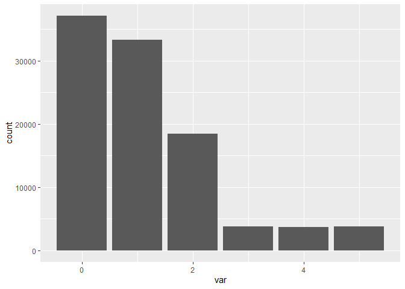

# Base R functions
Beth Jump
2025-07-10

``` r
library(tidyverse)
```

## Background

R was originally created for statisticians and there are some very handy
functions in base R and in the `stats` package (which is included with
the R installation).

## `sample()`

The `sample()` function allows you to select a sample from a list of
numbers. This is helpful both for randomly picking numbers from an array
and for generating a fake set of observations from a distribution.
Consider these two examples:

- We want to randomly select three unique numbers between 0-100:

``` r
set.seed(7)

sample(x = 0:100,
       size = 3)
```

    [1] 41 82 30

Note that we aren’t using the `replace` argument because by default
`replace = FALSE`. If we didn’t care about selecting the same number
twice, we could set `replace = TRUE`.

`set.seed()` ensures that each person running the code has the same
‘randomness’ and results that you have when you run it. More information
[here](https://www.statology.org/set-seed-in-r/).

- We want to generate some fake data from a set of numbers

``` r
dist <- sample(x = 0:5,
               size = 100000,
               replace = T,
               prob = c(10, 9, 5, rep(1, 3)))

dist %>%
  data.frame() %>%
  rename(var = 1) %>%
  ggplot() + 
  geom_bar(aes(x = var))
```



## `rep()`

The `rep()` function repeats an element a given number of times. Let’s
say you want to make a variable and you need the value `"yellow"` listed
three times. Instead of typing: `c("yellow", "yellow", "yellow")` you
can use:

``` r
rep("yellow", 3)
```

    [1] "yellow" "yellow" "yellow"

You might not use this very often, but if you find yourself typing the
same thing over and over consider using `rep()` instead.

## `replicate()`

`rep()` simply repeats the same element or result over and over while
`replicate()` will actually re-run code a specified number of times. We
used `replicate()` when we [compared the size, read and save times of
different types of
files](https://github.com/San-Mateo-County-Health-Epidemiology/R-User-Group/blob/a40a9f5eec3c8f3b3ba4b83cb5d0cfb35124ab8e/quarto-markdowns/r-scripts/file-type-comparison.R).

Here’s a quick example to show how the two are different.

If you repeat (`rep()`) the same sample 5 times, the result is just the
result from the first `sample()` printed five times:

``` r
rep(sample(1:10, 2), 
    5)
```

     [1] 8 7 8 7 8 7 8 7 8 7

If you `replicate()` the same sample 5 times, you’ll get 5 unique
results because the code is actually run 5 times:

``` r
replicate(5, 
          sample(1:10, 2))
```

         [,1] [,2] [,3] [,4] [,5]
    [1,]    8    7    1    7   10
    [2,]    2    3    9    8    4
