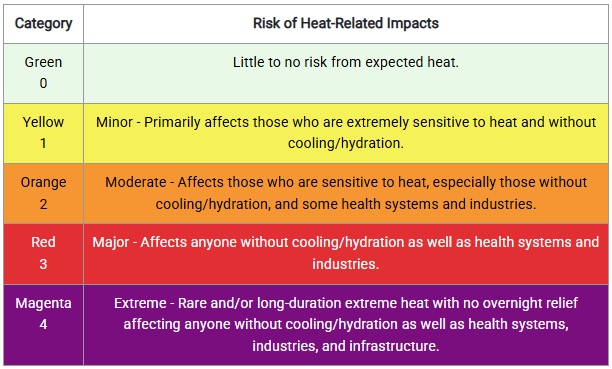

# Climate-related APIs
Sayema Badar
2025-10-02

## National Weather Service (NWS) API

### Overview

The [National Weather Service (NWS)
API](https://www.weather.gov/documentation/services-web-api) allows
users to access current and forecast weather data (maximum and minimum
temperature, relative humidity, probability of precipitation, windspeed
and wind direction), and alerts (watches/warnings/advisories for various
weather hazards). Further documentation for using the API can be found
[here](https://weather-gov.github.io/api/general-faqs).

Weather data for a point location can be retrieved by indicating the
location coordinates in the URL up to a maximum of four decimal places.
As the United States is within the northern and western hemispheres,
latitude is a positive value and longitude is a negative value,
respectively.

No key/token is required for this API. Data is received as a JSON object
of nested tables which can be parsed using the `jsonlite` package.

### Using the API

Using the example of Redwood City in San Mateo County, CA:

``` r
library(httr)
library(jsonlite)
library(tidyverse)
library(janitor)

# pull JSON object of nested tables for specified location 
location_rwc <- httr::GET(url = "https://api.weather.gov/points/37.4848,-122.2281") 
# pull URL for location forecast (gridpoints for NWS forecast office)
forecast_url_rwc <- jsonlite::fromJSON(rawToChar(location_rwc$content))$properties$forecast
# pull JSON object of nested tables for forecast of specified location
forecast_rwc <- GET(forecast_url_rwc)
# pull data into a dataframe
data_rwc <- fromJSON(rawToChar(forecast_rwc$content))$properties$periods 

glimpse(data_rwc)
```

    Rows: 14
    Columns: 14
    $ number                     <int> 1, 2, 3, 4, 5, 6, 7, 8, 9, 10, 11, 12, 13, …
    $ name                       <chr> "This Afternoon", "Tonight", "Friday", "Fri…
    $ startTime                  <chr> "2025-10-16T17:00:00-07:00", "2025-10-16T18…
    $ endTime                    <chr> "2025-10-16T18:00:00-07:00", "2025-10-17T06…
    $ isDaytime                  <lgl> TRUE, FALSE, TRUE, FALSE, TRUE, FALSE, TRUE…
    $ temperature                <int> 71, 52, 77, 55, 81, 56, 78, 54, 78, 56, 79,…
    $ temperatureUnit            <chr> "F", "F", "F", "F", "F", "F", "F", "F", "F"…
    $ temperatureTrend           <chr> "", "", "", "", "", "", "", "", "", "", "",…
    $ probabilityOfPrecipitation <df[,2]> <data.frame[14 x 2]>
    $ windSpeed                  <chr> "12 mph", "2 to 10 mph", "2 to 8 mph", "…
    $ windDirection              <chr> "NW", "SSW", "NE", "NNW", "N", "W", "WSW", …
    $ icon                       <chr> "https://api.weather.gov/icons/land/day/skc…
    $ shortForecast              <chr> "Sunny", "Mostly Clear", "Sunny", "Mostly C…
    $ detailedForecast           <chr> "Sunny. High near 71, with temperatures fal…

Note the data needs further cleaning. For example, there is no clearly
identifiable date variable.

### Example Data Cleaning

``` r
data_rwc1 <- data_rwc %>% 
  clean_names() %>% 
  mutate(date = as.Date(start_time), 
         max_temp_f = case_when(is_daytime == TRUE ~ temperature)) %>% 
  filter(is_daytime == TRUE) %>% 
  select(date, max_temp_f, probability_of_precipitation, wind_speed, wind_direction, short_forecast, detailed_forecast)


data_rwc2 <- data_rwc %>% 
  clean_names() %>% 
  mutate(date = as.Date(start_time),
         min_temp_f = case_when(is_daytime == FALSE ~ temperature)) %>% 
  filter(is_daytime == FALSE) %>% 
  select(date, min_temp_f)

data_rwc <- left_join(data_rwc1, 
                      data_rwc2, 
                      by = "date") %>% 
  select(date, max_temp_f, min_temp_f, everything()) 

glimpse(data_rwc)
```

    Rows: 7
    Columns: 8
    $ date                         <date> 2025-10-16, 2025-10-17, 2025-10-18, 2025…
    $ max_temp_f                   <int> 71, 77, 81, 78, 78, 79, 78
    $ min_temp_f                   <int> 52, 55, 56, 54, 56, 56, 55
    $ probability_of_precipitation <df[,2]> <data.frame[7 x 2]>
    $ wind_speed                   <chr> "12 mph", "2 to 8 mph", "5 mph", "1 to 8 …
    $ wind_direction               <chr> "NW", "NE", "N", "WSW", "N", "NNE", "W"
    $ short_forecast               <chr> "Sunny", "Sunny", "Sunny", "Sunny", "Sunn…
    $ detailed_forecast            <chr> "Sunny. High near 71, with temperature…

## HeatRisk API

### Overview

HeatRisk is a heat and health data-based index that provides current and
forecast heat risk developed jointly by NWS and Centers for Disease
Control (CDC). HeatRisk is available via
[NWS](https://www.wpc.ncep.noaa.gov/heatrisk/) or [CDC’s National
Environmental Public Health Tracking Network Data
Explorer](https://ephtracking.cdc.gov/DataExplorer/). The level of risk
is represented by a colour and number and the tool identifies groups
potentially most at risk at the indicated level. While HeatRisk cannot
be accessed by API via the NWS site, it can via the CDC site. Further
documentation for using the API can be found
[here](https://ephtracking.cdc.gov/apihelp).



The API URL can be accessed by creating a query via the Data Explorer
site linked above. Use the following parameters: **Heat & Heat-related
Illness (HRI)** \> **HeatRisk** \> **HeatRisk Forecast**. Continue
modifying the query for your purposes (geography type, geography, time).
Once the query runs, click the **Share** button to get the API URL.

While no key/token is required for this API, having a token is
recommended for faster data feed and to overcome limitations. A token
request can be made by emailing nephtrackingsupport@cdc.gov. Data is
received as a JSON object of nested tables which can be parsed using the
`jsonlite` package.

### Using the API

``` r
library(httr)
library(jsonlite)
library(tidyverse)
library(janitor)

# pull JSON object of nested tables for forecast of location specified in URL
hr_forecast <- httr::GET("url") 
# find data and pull into a dataframe
hr_data <-jsonlite::fromJSON(httr::content(hr_forecast, "text", encoding = "UTF-8"), flatten = TRUE)
hr_data <- hr_data$tableResult  
```

When using the example of a census tract in Redwood City in San Mateo
County, CA, this is what results: *Note: showing the code for this
example as there is additional code from the format above*

``` r
# define the timeframe to embed into URL (this is useful for automation)
hr_forecast_dates_rwc <- format(seq.Date(Sys.Date(), by = "day", length.out = 7), "%Y%m%d") 
# update URL to embed timeframe
hr_forecast_url_rwc <- paste0("https://ephtracking.cdc.gov/apigateway/api/v1/getCoreHolder/1457/137/1/6/8/", paste(hr_forecast_dates_rwc, collapse = ","), "/0/0")

hr_forecast_rwc <- httr::GET(hr_forecast_url_rwc)
hr_data_rwc <-jsonlite::fromJSON(httr::content(hr_forecast_rwc, "text", encoding = "UTF-8"), flatten = TRUE)
hr_data_rwc <- hr_data_rwc$tableResult 

hr_data_rwc <- hr_data_rwc %>% 
  clean_names() %>% 
  filter(geo_id == "06081610202")

glimpse(hr_data_rwc)
```

    Rows: 7
    Columns: 52
    $ id                             <chr> "1061967075", "1061809362", "1061842940…
    $ geographic_type_id             <int> 7, 7, 7, 7, 7, 7, 7
    $ geo                            <chr> "San Mateo County, CA - 06081610202", "…
    $ geo_id                         <chr> "06081610202", "06081610202", "06081610…
    $ geo_abbreviation               <chr> "CensusTractAbbreviation", "CensusTract…
    $ parent_geographic_type_id      <int> 1, 1, 1, 1, 1, 1, 1
    $ parent_geo                     <chr> "California", "California", "California…
    $ parent_geo_id                  <chr> "06", "06", "06", "06", "06", "06", "06"
    $ parent_geo_abbreviation        <chr> "CA", "CA", "CA", "CA", "CA", "CA", "CA"
    $ calculation_type               <chr> "Category", "Category", "Category", "Ca…
    $ temporal_type_id               <int> 8, 8, 8, 8, 8, 8, 8
    $ temporal                       <chr> "20251022", "20251016", "20251020", "20…
    $ temporal_description           <chr> "Day", "Day", "Day", "Day", "Day", "Day…
    $ temporal_column_name           <chr> "ReportDay", "ReportDay", "ReportDay", …
    $ temporal_rolling_column_name   <chr> "RollingCount", "RollingCount", "Rollin…
    $ temporal_id                    <int> 20251022, 20251016, 20251020, 20251018,…
    $ minimum_temporal               <lgl> NA, NA, NA, NA, NA, NA, NA
    $ minimum_temporal_id            <lgl> NA, NA, NA, NA, NA, NA, NA
    $ parent_temporal_type_id        <int> 1, 1, 1, 1, 1, 1, 1
    $ parent_temporal_type           <chr> "Year", "Year", "Year", "Year", "Year",…
    $ parent_temporal                <chr> "2025", "2025", "2025", "2025", "2025",…
    $ parent_temporal_id             <int> 2025, 2025, 2025, 2025, 2025, 2025, 2025
    $ parent_minimum_temporal_id     <lgl> NA, NA, NA, NA, NA, NA, NA
    $ parent_minimum_temporal        <lgl> NA, NA, NA, NA, NA, NA, NA
    $ data_value                     <chr> "2", "2", "2", "2", "2", "2", "2"
    $ display_value                  <chr> "2", "2", "2", "2", "2", "2", "2"
    $ group_by_id                    <chr> "1", "1", "1", "1", "1", "1", "1"
    $ no_data_id                     <int> -1, -1, -1, -1, -1, -1, -1
    $ hatching_id                    <int> -1, -1, -1, -1, -1, -1, -1
    $ hatching                       <lgl> NA, NA, NA, NA, NA, NA, NA
    $ suppression_flag               <chr> "0", "0", "0", "0", "0", "0", "0"
    $ no_data_break_group            <int> 0, 0, 0, 0, 0, 0, 0
    $ confidence_interval_low        <lgl> NA, NA, NA, NA, NA, NA, NA
    $ confidence_interval_high       <lgl> NA, NA, NA, NA, NA, NA, NA
    $ confidence_interval_name       <lgl> NA, NA, NA, NA, NA, NA, NA
    $ standard_error                 <lgl> NA, NA, NA, NA, NA, NA, NA
    $ standard_error_name            <lgl> NA, NA, NA, NA, NA, NA, NA
    $ secondary_value                <lgl> NA, NA, NA, NA, NA, NA, NA
    $ secondary_value_name           <lgl> NA, NA, NA, NA, NA, NA, NA
    $ descriptive_value              <lgl> NA, NA, NA, NA, NA, NA, NA
    $ descriptive_value_name         <lgl> NA, NA, NA, NA, NA, NA, NA
    $ include_descriptive_value_name <lgl> NA, NA, NA, NA, NA, NA, NA
    $ category_id                    <int> 2, 2, 2, 2, 2, 2, 2
    $ category                       <chr> "Minor", "Minor", "Minor", "Minor", "Mi…
    $ category_name                  <chr> "HeatRisk", "HeatRisk", "HeatRisk", "He…
    $ rollover                       <list> "HeatRisk: Minor", "HeatRisk: Minor", "…
    $ confidence_interval_low_name   <chr> "", "", "", "", "", "", ""
    $ confidence_interval_display    <chr> "", "", "", "", "", "", ""
    $ confidence_interval_high_name  <chr> "", "", "", "", "", "", ""
    $ secondary_value_display        <chr> "", "", "", "", "", "", ""
    $ standard_error_display         <chr> "", "", "", "", "", "", ""
    $ title                          <chr> "San Mateo County, CA - 06081610202", "…

Note the data is pretty messy - not in chronological order and
unnecessary variables - and needs to be cleaned.

### Example Data Cleaning

``` r
hr_data_rwc <- hr_data_rwc %>% 
  select(!category_name) %>% 
  rename(category_number = category_id,
         category_name = category) %>% 
  mutate(date = ymd(temporal)) %>% 
  arrange(date) %>% 
  select(date, geo, geo_id, category_number, category_name)

glimpse(hr_data_rwc)
```

    Rows: 7
    Columns: 5
    $ date            <date> 2025-10-16, 2025-10-17, 2025-10-18, 2025-10-19, 2025-…
    $ geo             <chr> "San Mateo County, CA - 06081610202", "San Mateo Count…
    $ geo_id          <chr> "06081610202", "06081610202", "06081610202", "06081610…
    $ category_number <int> 2, 2, 2, 2, 2, 2, 2
    $ category_name   <chr> "Minor", "Minor", "Minor", "Minor", "Minor", "Minor", …
