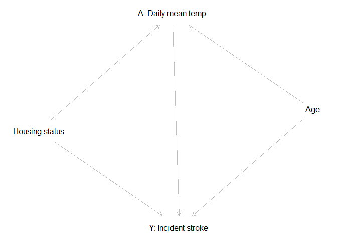
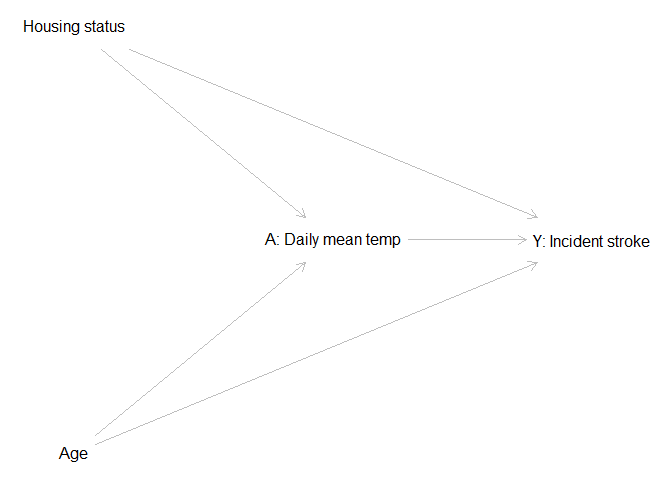

# Use DAGitty to make DAGs in R
Julie Bartels
2026-04-24

Directed acyclic graphs (DAGs) are useful tools for epidemiologists to
graphically depict knowledge about systems related to causal research
questions to help isolate causal effects of interest, and determine how
to adjust for biases through study design or data analysis.

This tutorial assumes a working knowledge of causal inference and the
use of DAGs in epidemiological research. Some readings to support this
knowledge can be found here:

- https://pmc.ncbi.nlm.nih.gov/articles/PMC8821727/;
- https://med.stanford.edu/content/dam/sm/s-spire/documents/WIP-DAGs_ATrickey_Final-2019-01-28.pdf.

DAGitty is an online application (https://dagitty.net/) that can be used
to draw DAGs and determine which variables need to be adjusted for in
analyses to control for confounding. DAGitty can also be accessed in R
to build DAGs directed in the R Studio platform using the **dagitty**
package.

This tutorial explains how to:

1.  Encode relationships between variables for the DAG.
2.  Visualize the DAG in R.

This seminar recording provides some extra context and help using the
DAGitty package: https://www.youtube.com/watch?v=LCC4BkLZo-g.

## 1. Encode relationships

### 1a. Load libraries

``` r
library(dplyr)
library(tidyverse)
library(smcepi) # devtools::install_github("San-Mateo-County-Health-Epidemiology/smcepi")
#install.packages('dagitty')
library(dagitty)
```

### Set relationships between variables in the DAG

The main common components of a DAG are:

1.  A (or E): The exposure variable (also could be treatment or
    intervention)
2.  Y (or D): The outcome (or disease)
3.  C: Covariates
4.  U: Unmeasured covariates

For this example, we will consider a system in which we are trying to
isolate the effects of ambient temperature on incident stroke.

Therefore, in this example we will set the variables as follows (this is
a selected list):

A (Exposure): Daily mean temperature Y (Outcome) : Incident stroke C
(Covariates): Age, housing status

``` r
# Daily mean temp -> Incident stroke as main exposure-outcome of interest
# Age as a confounder
# Housing status as a confounder

dag <- dagitty('dag {
             "A: Daily mean temp" -> "Y: Incident stroke"
             
             "A: Daily mean temp" <- "Age" -> "Y: Incident stroke"
             
             "A: Daily mean temp" <- "Housing status" -> "Y: Incident stroke"
             
             }'
                    
)
```

# 2. Plot DAG

The *plot()* function in **dagitty** allows quick visualization of the
DAG, although it may not be set up in the format that we typically would
like to see for DAGs (considering temporality, etc.)

Here, quickly plot the DAG to see how it looks:

``` r
plot(dag)
```

    Plot coordinates for graph not supplied! Generating coordinates, see ?coordinates for how to set your own.



Set coordinates on an (x,y) plot to ensure placement of the variables in
your preferred location.

``` r
# Set coordinates
coordinates(dag) <-
  list( x=c("A: Daily mean temp"= 2, 
            "Y: Incident stroke"= 3, 
            "Age"= 1, 
            "Housing status" = 1), 
        y=c("A: Daily mean temp"= 0, 
            "Y: Incident stroke" = 0, 
            "Age"= 1, 
            "Housing status" = -1) 
            )

# Plot
plot(dag)
```



# 3. Determine minimal adjustment set

The minimal adjustment set are the minimal set of variables you need to
adjust for in your analysis to isolate the causal effect of interest.

``` r
# Specify the exposure and outcome of interest
adjustmentSets(dag, "A: Daily mean temp", "Y: Incident stroke")
```

    { Age, Housing status }

Here, we need to adjust for age and housing status in our analysis.

This is only the tip of the iceberg for DAGs!
