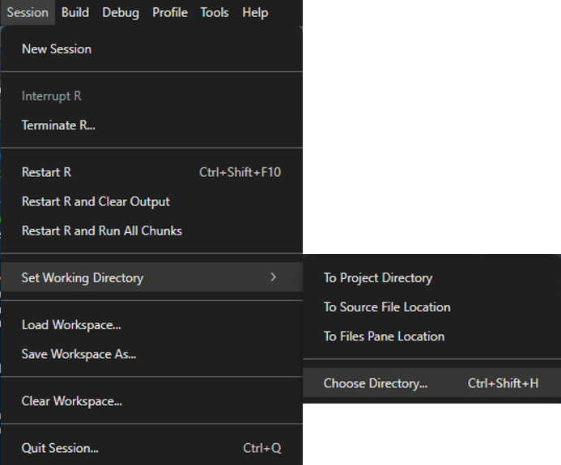

# File management
Beth Jump
2025-01-22

# Overview

While not central to our work as epidemiologists, knowing some basic
file management in R can save you time and allow you to do some pretty
cool things.

We’ll go over some basic functions that hopefully make working with
files from R a bit easier!

# Finding files

## `file.choose()`

Before you do anything in R, you need to import data into R and this
often involves using a file path. You can either type out the path or
you can use the `file.choose()` function. Run the `file.choose()` in
your console and a File Explorer window will open. Navigate to the file
you want to import into R, select **Open** and the path of the file will
appear in the console!

*Note: if you do manually type a path, you should either use a double
back slash `\\` or a single forward slash `/`. A single back slash in R
is an “escape character” and R will get cranky if you try to use one in
a file path. More about escape characters
[here](https://www.w3schools.com/r/r_strings_esc.asp).*

## `here` package

If you don’t want to use a full file path or you don’t have an exact
file path, you can use the `here` function from the
[`here`](https://here.r-lib.org/) package.

This is really useful if you have an R project and want to read data in
from a `data/` directory into a quarto or R markdown that is stored
somewhere else. If you use a full file path, the data needs to be stored
in the same directory or a sub-directory of where your markdown file
lives. With `here::here()` the data can live anywhere in the project!!

# Manipulating files and directories

Let’s start with some basic terminology:

**file**: single file with an extension, ie: .pdf, .docx, .Rmd, .qmd,
etc  
**directory**: also known as a folder. Contains files or can be empty

We’ll go through these in detail, but here is an index of the functions
covered in this file. All of these are base R functions.

| Function        | Purpose                                             |
|-----------------|-----------------------------------------------------|
| `list.files()`  | lists all the files in a directory                  |
| `list.dirs()`   | lists all the directories in a directory            |
| `file.info()`   | gives you information about a file or set of files  |
| `getwd()`       | returns your current working directory              |
| `setwd()`       | allows you to specify a different working directory |
| `dir.create()`  | creates a directory                                 |
| `unlink()`      | deletes a directory                                 |
| `file.copy()`   | copies a file from one place to another             |
| `file.remove()` | deletes a file                                      |

## Viewing files and directories

This will tell you what files are in your current directory

``` r
list.files()
```

     [1] "data"                          "date-basics.md"               
     [3] "date-basics.qmd"               "dynamic-selecting.md"         
     [5] "dynamic-selecting.qmd"         "file-management.md"           
     [7] "file-management.rmarkdown"     "file-management.Rmd"          
     [9] "file-type-comparison.md"       "file-type-comparison.qmd"     
    [11] "file-type-comparison_files"    "future-meetings"              
    [13] "images"                        "intro-to-quarto.md"           
    [15] "intro-to-quarto.qmd"           "plotly-basics.md"             
    [17] "plotly-basics.qmd"             "r-scripts"                    
    [19] "separate-by-delim.md"          "separate-by-delim.qmd"        
    [21] "separate-wider-and-longer.md"  "separate-wider-and-longer.qmd"
    [23] "tidyverse-practice.md"         "tidyverse-practice.qmd"       

You can add arguments to make your search more specific. Here we are
looking for any .qmd (Quarto) files in any directory or sub directory of
the current directory

- `pattern = "*.qmd"` specifies that we’re interested in any `.qmd`
  file  
- `recursive = T` specifies that we want to look in the current
  directory and in any sub-directories. `recursive = F` is the default.
  It only looks in the current directory  
- `full.names = T` returns full file paths for the files

``` r
list.files(pattern = "*.qmd",
           recursive = T,
           full.names = T)
```

    [1] "./date-basics.qmd"                        
    [2] "./dynamic-selecting.qmd"                  
    [3] "./file-type-comparison.qmd"               
    [4] "./future-meetings/getting-data-into-R.qmd"
    [5] "./intro-to-quarto.qmd"                    
    [6] "./plotly-basics.qmd"                      
    [7] "./separate-by-delim.qmd"                  
    [8] "./separate-wider-and-longer.qmd"          
    [9] "./tidyverse-practice.qmd"                 

Sometimes it’s enough to just know what files are in your directory, but
often you need more information. You can wrap your `list.files()` call
with `file.info()`. This gives you additional information about each
file including: size, create, modified and accessed time and an
indicator for whether or not the file is a file or a directory.

``` r
file.info(list.files(pattern = "*.qmd",
           recursive = T,
           full.names = T))
```

                                               size isdir mode               mtime
    ./date-basics.qmd                          3843 FALSE  666 2024-11-14 11:21:28
    ./dynamic-selecting.qmd                    4164 FALSE  666 2024-10-31 11:51:50
    ./file-type-comparison.qmd                 9609 FALSE  666 2024-11-04 14:17:40
    ./future-meetings/getting-data-into-R.qmd  3343 FALSE  666 2024-10-31 09:37:27
    ./intro-to-quarto.qmd                      3210 FALSE  666 2024-10-31 14:37:50
    ./plotly-basics.qmd                        3461 FALSE  666 2024-10-31 14:50:28
    ./separate-by-delim.qmd                    4997 FALSE  666 2024-10-31 11:51:59
    ./separate-wider-and-longer.qmd            5063 FALSE  666 2024-11-14 10:14:09
    ./tidyverse-practice.qmd                  10019 FALSE  666 2024-10-31 14:04:55
                                                            ctime
    ./date-basics.qmd                         2024-10-23 18:56:38
    ./dynamic-selecting.qmd                   2024-10-23 16:20:00
    ./file-type-comparison.qmd                2024-11-04 14:17:40
    ./future-meetings/getting-data-into-R.qmd 2024-10-31 08:36:28
    ./intro-to-quarto.qmd                     2024-10-31 09:28:20
    ./plotly-basics.qmd                       2024-10-31 14:07:40
    ./separate-by-delim.qmd                   2024-10-23 15:38:16
    ./separate-wider-and-longer.qmd           2024-10-24 08:32:54
    ./tidyverse-practice.qmd                  2024-10-24 11:19:56
                                                            atime exe
    ./date-basics.qmd                         2025-01-22 16:43:18  no
    ./dynamic-selecting.qmd                   2025-01-22 16:43:18  no
    ./file-type-comparison.qmd                2025-01-22 16:43:18  no
    ./future-meetings/getting-data-into-R.qmd 2025-01-22 16:43:18  no
    ./intro-to-quarto.qmd                     2025-01-22 16:43:18  no
    ./plotly-basics.qmd                       2025-01-22 16:43:18  no
    ./separate-by-delim.qmd                   2025-01-22 16:43:18  no
    ./separate-wider-and-longer.qmd           2025-01-22 16:43:18  no
    ./tidyverse-practice.qmd                  2025-01-22 16:43:18  no

## Moving files from R

Let’s say we want to save the `palmerpenguins::penguins()` data set for
use within this repository. We will load the data, make a directory and
save the data to that directory.

First we’ll load the `palmerpenguins::penguins()` data into our
environment and will save it as an object called `penguins`

``` r
penguins <- palmerpenguins::penguins
```

Then we’ll create a directory in which to store the data using
`dir.create()`:

``` r
dir.create("data-penguins")
list.dirs()
```

    [1] "."                                             
    [2] "./data"                                        
    [3] "./data-penguins"                               
    [4] "./file-type-comparison_files"                  
    [5] "./file-type-comparison_files/figure-commonmark"
    [6] "./future-meetings"                             
    [7] "./images"                                      
    [8] "./r-scripts"                                   

Lastly, we’ll save the `penguins` data in the directory we just created:

``` r
saveRDS(penguins,
        file = "data-penguins/penguins.RDS")

list.files(path = "data-penguins")
```

    [1] "penguins.RDS"

After doing this, we realize that there already is a `data` folder in
our directory:

``` r
list.dirs()
```

    [1] "."                                             
    [2] "./data"                                        
    [3] "./data-penguins"                               
    [4] "./file-type-comparison_files"                  
    [5] "./file-type-comparison_files/figure-commonmark"
    [6] "./future-meetings"                             
    [7] "./images"                                      
    [8] "./r-scripts"                                   

We want to move the `penguins` data into the `data/` folder and then
want to delete the original file we wrote and the directory we created.

We can use `file.copy()` to copy the file from the `data-penguins/`
folder to the `data/` folder:

``` r
file.copy(from = "data-penguins/penguins.RDS",
          to = "data/penguins.RDS")
```

    [1] TRUE

``` r
list.files(path = "data")
```

    [1] "file-type-comparison.RDS" "penguins.RDS"            

Then we’ll delete the file from the wrong folder with `file.remove()`:

``` r
# remove the file saved in the wrong directory
file.remove("data-penguins/penguins.RDS")
```

    [1] TRUE

``` r
list.files(path = "data-penguins")
```

    character(0)

And lastly we’ll delete the directory with `unlink()`. Note that you
need to include the `recursive = T` argument for `unlink()` to remove
the directory.

``` r
# delete the directory
unlink("data-penguins", 
       recursive = T)
list.dirs()
```

    [1] "."                                             
    [2] "./data"                                        
    [3] "./file-type-comparison_files"                  
    [4] "./file-type-comparison_files/figure-commonmark"
    [5] "./future-meetings"                             
    [6] "./images"                                      
    [7] "./r-scripts"                                   

That’s it! You likely won’t use this workflow to move a single file, but
if you want to move a lot of files, this is a great option.

Note: `file.copy()` works with all sorts of files! We use this when we
render the ED Census `.pdf` report each morning. There’s a “bug” that
throws an error if you want to render an R Markdown to a file path that
has spaces in it. You can get around this by rendering your markdown to
a path without spaces, copying the file to the correction location and
then deleting the original file. We render the ED Census report to a
path without spaces, then copy it into the DSAT folder and then delete
it from the original location!

# Working with directories

## Basics

If you’re working within a GitHub repo or R project, the working
directory should be the highest directory in the project. This is the
directory that has the `.gitignore` and `.Rproj` files. You don’t need
to use `setwd()` to specify this, R will default to that directory.

If you’re not working with a GitHub repo or R project, you will probably
need to manually set your working directory with `setwd()`.

You can always check your working directory with `getwd()`

``` r
getwd()
```

    [1] "C:/Users/ejump/OneDrive - County of San Mateo/R Projects/R-User-Group/quarto-markdowns"

## Navigating directories

You can set “absolute” or “relative” directories in R.

An absolute directory is a specific path. You can use the `setwd()`
function or you can to to Session \> Set Working Directory \> Choose
Directory and set the directory using a point and click interface.



A relative directory is a directory that is specified in relation to the
home directory. You can also set relative directories with `setwd()`

This is our current directory:

``` r
getwd()
```

    [1] "C:/Users/ejump/OneDrive - County of San Mateo/R Projects/R-User-Group/quarto-markdowns"

Now lets move one directory down (to a folder further from the main
project). To do this, we need to specify the directory name(s) where we
want to go:

``` r
setwd("data")
getwd()
```

    [1] "C:/Users/ejump/OneDrive - County of San Mateo/R Projects/R-User-Group/quarto-markdowns/data"

``` r
list.files()
```

    [1] "file-type-comparison.RDS"

Now lets move two directories up (closer to the main project). Note that
here we don’t need to specify the directories by name. `..` means move
to the parent of the current directory.

``` r
setwd("../../")
getwd()
```

    [1] "C:/Users/ejump/OneDrive - County of San Mateo/R Projects"

There’s a nice explanation of directory shorthand in R
[here](https://stackoverflow.com/questions/37380961/moving-down-a-folder-in-working-directory)
