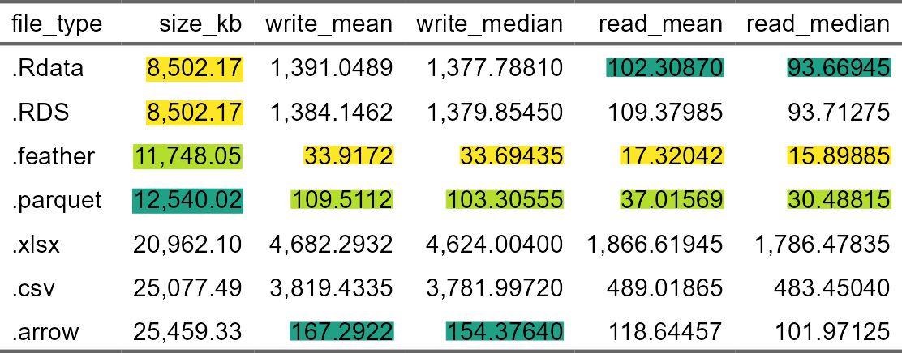
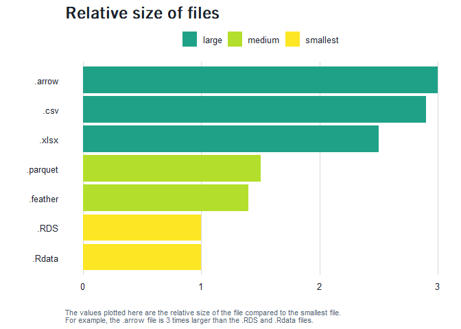
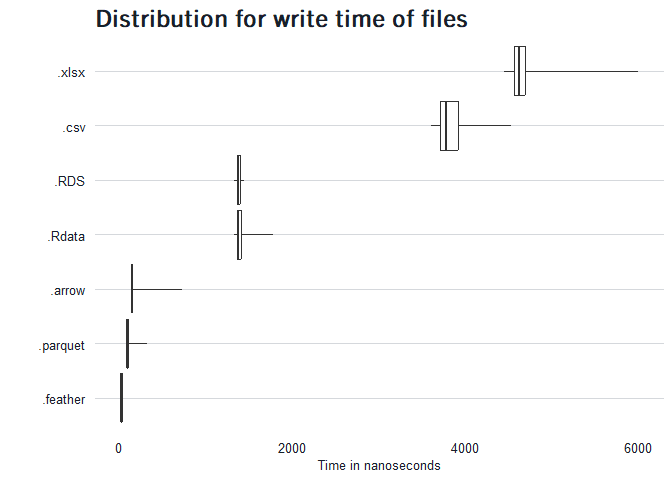
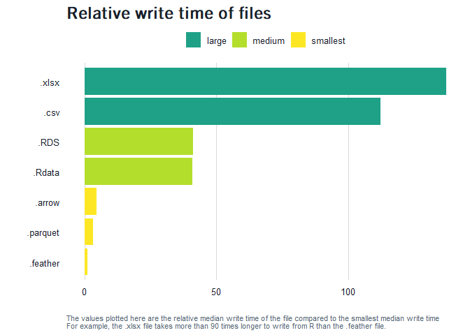
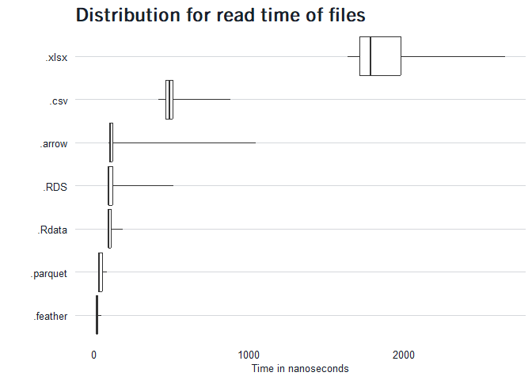
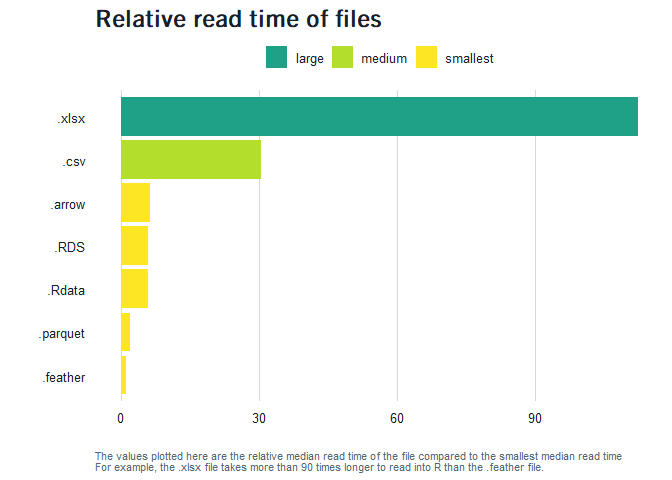

# file type comparison
Beth Jump
2024-03-22

## Overview

When we load files into R and save files from R, we can sometimes choose
which format to use. When we can choose, we should try to optimize for
reading and writing speed and size.

Here we’ll compare the sizes and speeds for seven file types:

- `.csv`: comma separated value file
- `.xlsx`: Microsoft Excel file
- `.RData`: used to store one or more R objects
- `.RDS`: used to store a single R object
- `.parquet`: compressed, columnar file with more encoding than arrow or
  feather
- `.feather`: compressed, columnar file for short term storage
- `.arrow`: compressed, columnar file for short term storage

## Results

To compare reading and writing times and storage sizes, we’ll use a
simulated data set that has 100,000 rows and 21 variables. The code to
create the data and calculate the time to read and write is all in a
separate R file
[here](https://github.com/San-Mateo-County-Health-Epidemiology/R-User-Group/blob/main/quarto-markdowns/r-scripts/file-type-comparison.R).

We use the
[`microbenchmark`](https://www.rdocumentation.org/packages/microbenchmark/versions/1.5.0/topics/microbenchmark)
package to compare the time needed to read and write the different types
of files.

These are the summary data for 100 trials:

The gist here is to try and avoid storing data in `.xlsx`, `.csv` and
`.arrow` unless you have a reason to. These take up 2.5-3 times as much
space as storing the data in a `.Rdata` or `.RDS` file and take a lot
longer to load into R and write from R.

While the `.Rdata` and `.RDS` files take up the least storage space,
`.feather` and `.parquet` are the quickest to read and write into R and
only take up ~ 1.5 times as much space as the `.Rdata` and `.RDS` files.

## Recommendations

- To share outside of the Epi team: **`.xlsx`**
  - You can really only share data with other teams in a `.csv` or
    `.xlsx.` If you save the same data set in an `.xlsx` and a `.csv`,
    the `.xlsx` will take up less space, will allow you to create
    multiple tabs and will allow the end user to add their own
    formatting without changing the file type. Basically, there is no
    reason to save a `.csv` instead of a `.xlsx.`  
  - Recommended package:
    [`writexl`](\https://docs.ropensci.org/writexl/). Use the
    `write_xlsx()` function
    - `write_xlsx(list(tab1 = data1, tab2 = data2,`Hello
      world`= data3), path)`  
    - if you use the tick marks (the key to the left of the 1), you can
      include spaces in the tab names
- To save for use by other Epis: **`.feather`** or **`.parquet`**
  - `.feather` files are slightly larger than `.parquet` files but are
    slightly faster to read and write into R
  - A huge pro for using these files is that they can be read into
    Python and Stata in addition to R
  - Recommended package: [arrow](https://arrow.apache.org/docs/r/). Use
    the `write_feather()` or `write_parquet()` functions
- To save for use by other Epis when variable types are important:
  **`.RDS`** or **`.Rdata`**
  - When it’s really important to preserve the variable types in a data
    set, save the object in a native R format
  - We did this during COVID with the COVID UDF CalREDIE export. Some
    variables had blanks for the first 30,000 rows and if you read the
    file in as a `.tsv`, you would need to increase the `guess_max` to
    30,000 to get data in that column! When we saved it as a `.RData`
    file, we didn’t need to worry about `guess_max()`

## Details

### File sizes

### Writing data from R

### Reading files into R

