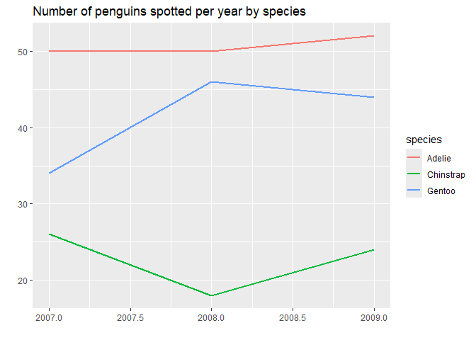
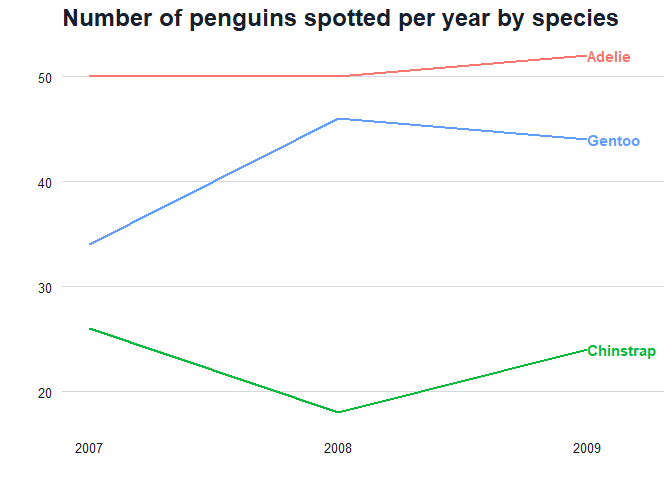
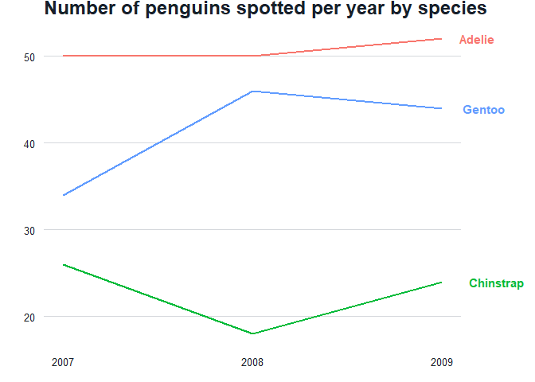

# Grammar of graphics & labelling plots
Beth Jump
2025-06-26

## Grammar of graphics

[`ggplot2`](https://ggplot2.tidyverse.org/) charts are built according
to the Grammar of Graphics. For more information, check out this
[book](https://ggplot2-book.org/).

## Adding labels to plots

When possible, you should add labels directly to plots instead of having
a legend. We’ll go through how to do that with the
`palmgerpenguins::penguins` data set.

``` r
library(tidyverse)
library(lubridate)
library(palmerpenguins)
library(smcepi)

# look at the data
str(penguins)
```

    tibble [344 × 8] (S3: tbl_df/tbl/data.frame)
     $ species          : Factor w/ 3 levels "Adelie","Chinstrap",..: 1 1 1 1 1 1 1 1 1 1 ...
     $ island           : Factor w/ 3 levels "Biscoe","Dream",..: 3 3 3 3 3 3 3 3 3 3 ...
     $ bill_length_mm   : num [1:344] 39.1 39.5 40.3 NA 36.7 39.3 38.9 39.2 34.1 42 ...
     $ bill_depth_mm    : num [1:344] 18.7 17.4 18 NA 19.3 20.6 17.8 19.6 18.1 20.2 ...
     $ flipper_length_mm: int [1:344] 181 186 195 NA 193 190 181 195 193 190 ...
     $ body_mass_g      : int [1:344] 3750 3800 3250 NA 3450 3650 3625 4675 3475 4250 ...
     $ sex              : Factor w/ 2 levels "female","male": 2 1 1 NA 1 2 1 2 NA NA ...
     $ year             : int [1:344] 2007 2007 2007 2007 2007 2007 2007 2007 2007 2007 ...

Let’s look at the number of penguins spotted by year.

``` r
plot1 <- penguins %>% 
  mutate(year = as.integer(year)) %>%
  count(year, species) %>%
  ggplot() +
  geom_line(aes(x = year,
                y = n,
                group = species,
                color = species),
            linewidth = 1) +
  labs(title = "Number of penguins spotted per year by species",
       x = "",
       y = "")
plot1
```



This looks OK, but ideally we’d want to label the values directly on the
plot. We can do that by isolating the points we want to label. For a
line chart, we typically want to label the values that are farthest to
the right. Here were are manipulating the data to only keep the last
observation per group:

``` r
labels <- penguins %>%
  count(year, species) %>%
  group_by(species) %>% 
  arrange(desc(year)) %>%
  slice(1) %>%
  ungroup()
labels
```

    # A tibble: 3 × 3
       year species       n
      <int> <fct>     <int>
    1  2009 Adelie       52
    2  2009 Chinstrap    24
    3  2009 Gentoo       44

Now we’ll add them to our plot with `geom_text()`. A couple of things to
note:

- we have to specify which data we want to use (`data = labels`) because
  we’re pulling the labels from the `labels` data frame and not the
  `penguins` data frame
- `hjust = 0` makes it so the label starts at the point mapped in the
  `aes()` argument. If you don’t use this, your label will be centered
  on the point which can make it hard to read
- `expand_limits()` allows you to expand the chart space past the
  default. This is helpful if the default space cuts off your labels.
- To expand your axis without specifying a specific range, use the
  `expand` argument in `scale_x_...`. For example,
  `expand = expansion(mult = c(0, 0.25))` will expand the x axis 25% and
  `expand = expansion(add = c(0,0.2))` will add 0.2 x units to the right
  side of the plot.

``` r
plot2 <- plot1 +
  geom_text(data = labels,
            aes(x = year, 
                y = n,
                label = species,
                color = species),
            hjust = 0,
            fontface = "bold") + 
  theme_gg_smc(legend_loc = "none") +
  scale_x_continuous(breaks = c(2007, 2008, 2009)) + 
  expand_limits(x = c(2007, 2009.2))
plot2
```



If you want your labels outside of the plot area:

- use `coord_cartesian(clip = "off")` to allow plotting outside the plot
  margin.
- then specify a larger right-side margin using the `plot.margin`
  argument in `theme`.
- use `hjust` to shift your labels if need-be (a challenge here is that
  `hjust` shifts labels by a percent of the label length, so you may
  lose your left-justification if you set `hjust` to a non-0 value).

``` r
plot3 <- plot1 +
  geom_text(data = labels,
            aes(x = year, 
                y = n,
                label = species,
                color = species),
            hjust = -0.5,
            fontface = "bold") + 
  coord_cartesian(clip = "off")  + 
  theme_gg_smc(legend_loc = "none") +
  theme(plot.margin = margin(t=0,r=70,b=0,l=0)) +
  scale_x_continuous(breaks = c(2007, 2008, 2009))
plot3
```


