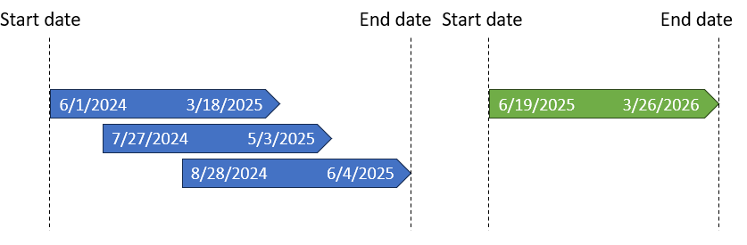

# Identify and consolidate overlapping date ranges in longitudinal data
Asa Ohsaki

## Overview

When working with longitudinal data, we may need to identify multiple
incidents and consolidate them in order to accurately capture one whole
incident. For example, some people may show up in hospital data as
having multiple overlapping stays, when in fact it was one long
hospitalization that spans the entirety of the multiple
hospitalizations.

For this scenario, we are trying to find any births that resulted within
a 40 week window of program outreach interactions. This patient had
three interactions with this program in 2024 and one interaction in
2025.

The 40 week windows for the 2024 visits overlap, so before we look for
births in each time frame, we have to turn the three visits into one
long visit. We should end up with one time frame in 2024 and another in
2025.



``` r
library(tidyverse)

# Create an example dataset for 1 patient
data <- data.frame(
  id = rep(1, 4),
  start_date = c("2024-06-11", "2024-07-27", "2024-08-28", "2025-06-19"))
data
```

      id start_date
    1  1 2024-06-11
    2  1 2024-07-27
    3  1 2024-08-28
    4  1 2025-06-19

After sorting in chronological order, use lead and lag to find the
previous start-end time frame and the next start-end time frame for each
outreach event.

``` r
data1 <- data %>%
  mutate(start_date = as.Date(start_date),
         end_date = start_date + weeks(40)) %>%
  group_by(id) %>%
  arrange(start_date) %>%
  mutate(prev_start = lag(start_date),
         prev_end = lag(end_date),
         next_start = lead(start_date),
         next_end = lead(end_date))
data1
```

    # A tibble: 4 × 7
    # Groups:   id [1]
         id start_date end_date   prev_start prev_end   next_start next_end  
      <dbl> <date>     <date>     <date>     <date>     <date>     <date>    
    1     1 2024-06-11 2025-03-18 NA         NA         2024-07-27 2025-05-03
    2     1 2024-07-27 2025-05-03 2024-06-11 2025-03-18 2024-08-28 2025-06-04
    3     1 2024-08-28 2025-06-04 2024-07-27 2025-05-03 2025-06-19 2026-03-26
    4     1 2025-06-19 2026-03-26 2024-08-28 2025-06-04 NA         NA        

Next, identify type of overlap - overlaps with previous time range, or
overlaps with future time range. Then assign row type. “First” row is
any row that has no previous overlap but an overlap with the next range,
“middle” is any row that overlaps with the previous and subsequent
range, and “last” is any row that overlaps with the previous but not the
next range. “None” is a row that doesn’t overlap with any other range.

``` r
data1 <- data1 %>%
         mutate(prev_overlap = case_when(start_date >= prev_start & start_date <= prev_end ~ 1,
                                  TRUE ~ 0),
                next_overlap = case_when(next_start >= start_date & next_start < end_date ~ 1,
                                  TRUE ~ 0),
                row_type = case_when(prev_overlap == 0 & next_overlap == 1 ~ "first",
                              prev_overlap == 1 & next_overlap == 1 ~ "middle",
                              prev_overlap == 1 & next_overlap == 0 ~ "last",
                              prev_overlap == 0 & next_overlap == 0 ~ "none"))
data1
```

    # A tibble: 4 × 10
    # Groups:   id [1]
         id start_date end_date   prev_start prev_end   next_start next_end  
      <dbl> <date>     <date>     <date>     <date>     <date>     <date>    
    1     1 2024-06-11 2025-03-18 NA         NA         2024-07-27 2025-05-03
    2     1 2024-07-27 2025-05-03 2024-06-11 2025-03-18 2024-08-28 2025-06-04
    3     1 2024-08-28 2025-06-04 2024-07-27 2025-05-03 2025-06-19 2026-03-26
    4     1 2025-06-19 2026-03-26 2024-08-28 2025-06-04 NA         NA        
    # ℹ 3 more variables: prev_overlap <dbl>, next_overlap <dbl>, row_type <chr>

Separate data into overlaps and non-overlaps. For the overlaps, we only
care about the first and last time frames so we can take the start date
of the first time frame and the end date of the last time frame using
lead.

``` r
# Overlaps
overlaps <- data1 %>%
  filter(row_type %in% c("first", "last")) %>%
  mutate(last_overlap = lead(end_date)) %>%
  filter(row_type == "first") 
overlaps
```

    # A tibble: 1 × 11
    # Groups:   id [1]
         id start_date end_date   prev_start prev_end next_start next_end  
      <dbl> <date>     <date>     <date>     <date>   <date>     <date>    
    1     1 2024-06-11 2025-03-18 NA         NA       2024-07-27 2025-05-03
    # ℹ 4 more variables: prev_overlap <dbl>, next_overlap <dbl>, row_type <chr>,
    #   last_overlap <date>

``` r
# Non-overlaps
non_overlaps <- data1 %>%
  filter(row_type == "none")
non_overlaps
```

    # A tibble: 1 × 10
    # Groups:   id [1]
         id start_date end_date   prev_start prev_end   next_start next_end
      <dbl> <date>     <date>     <date>     <date>     <date>     <date>  
    1     1 2025-06-19 2026-03-26 2024-08-28 2025-06-04 NA         NA      
    # ℹ 3 more variables: prev_overlap <dbl>, next_overlap <dbl>, row_type <chr>

Combine overlaps and non-overlaps to get your final consolidated
dataset.

``` r
final <- overlaps %>%
  select(id, start_date, last_overlap) %>%
  rename(end_date = last_overlap) %>%
  bind_rows(non_overlaps %>% select(id, start_date, end_date))
final
```

    # A tibble: 2 × 3
    # Groups:   id [1]
         id start_date end_date  
      <dbl> <date>     <date>    
    1     1 2024-06-11 2025-06-04
    2     1 2025-06-19 2026-03-26

We now can search for any births that happened in these two time frames.
