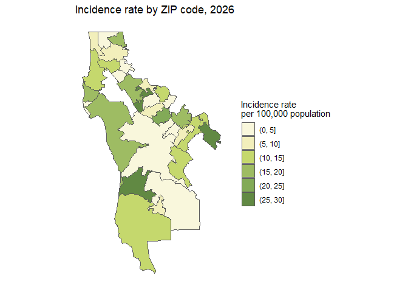
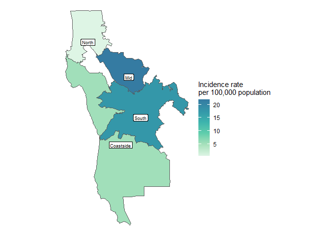
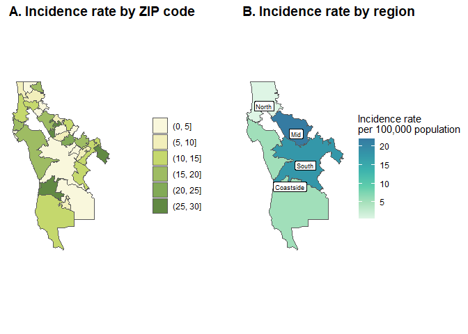

# Map in R using ggplot2 package
Julie Bartels
2026-04-24

The **sf** and **ggplot2** R libraries allow flexible and easy
preparation of choropleth maps in R, which can be used in publications
or reports.

This tutorial explains how to:

1.  Download shape files for ZIP codes and census tracts using the
    **tidycensus** package
2.  Join rate/count data to shapefiles
3.  Map incidence rates by ZIP code
4.  Aggregate smaller geographic areas up into custom regions for
    mapping
5.  Map plots together for publications or reports.

## 1. Map incidence rates by ZIP code for San Mateo County

### 1a. Load libraries

``` r
library(dplyr)
library(tidyverse)
library(smcepi) # devtools::install_github("San-Mateo-County-Health-Epidemiology/smcepi")
library(tidycensus)
library(sf)
library(ggplot2)
```

### 1b. Create sample dataframe

First, create sample incidence rate data by ZIP code for San Mateo
County.

``` r
# Vector of SMC ZIP codes
smc_zips <- c('94018', '94019', '94020', '94021', '94037', 
              '94038', '94060', '94074', '94002', '94010', 
              '94065', '94070', '94401', '94402', '94403', 
              '94404', '94005', '94014', '94015', '94030', 
              '94044', '94066', '94080', '94128', '94025', 
              '94027', '94028', '94061', '94062', '94063', '94303')

# Create sample dataset of incidence rates in SMC by ZIP code
set.seed(2026)

smc_zip_data <- tibble(
  zip_code = smc_zips,
  inc_rate = runif(31, min = 0, max = 30) # randomly sample values from a uniform distribution
)

head(smc_zip_data)
```

    # A tibble: 6 × 2
      zip_code inc_rate
      <chr>       <dbl>
    1 94018      21.0  
    2 94019      16.7  
    3 94020       4.20 
    4 94021       8.57 
    5 94037      16.7  
    6 94038       0.754

### 1c. Get SMC ZIP code geography

Next, use the **tidycensus** package to get shape files for the geometry
of SMC ZIP codes to use for mapping.

``` r
# Get SMC ZIP code geography from the tidycensus package
ca_zips <- get_acs(
  geography = "zcta", # set zcta files (ZIP codes)
  variables = "B01003_001", # set one or more census data variables
  year = 2019, # set census (ACS) year
  state = "CA", # set state of interest - note that for ZCTAs you have to download the entire state
  geometry = TRUE)

# Filter for only SMC ZIP codes
smc_pop <- ca_zips %>%
  filter(GEOID %in% smc_zips)
```

Note that you can also get shapefiles by census tract using the
**tidycensus** package, as shown below:

``` r
# By census tract
smc_ct <- get_acs(
  geography = "tract", # specify tract as geography
  variables = "B01003_001",
  state = "CA", # set state of interest
  county = "San Mateo", # set county of interest
  geometry = TRUE)
```

### 1d. Join incidence rate data to SMC pop data

Join sample data to the shapefile.

``` r
smc_zip_data_geo <- smc_pop %>%
  left_join(., smc_zip_data, 
            by = c('GEOID' = 'zip_code'))

head(smc_zip_data_geo)
```

    Simple feature collection with 6 features and 6 fields
    Geometry type: MULTIPOLYGON
    Dimension:     XY
    Bounding box:  xmin: -122.5195 ymin: 37.31165 xmax: -122.1214 ymax: 37.61505
    Geodetic CRS:  NAD83
      GEOID        NAME   variable estimate  moe   inc_rate
    1 94019 ZCTA5 94019 B01003_001    20512  764 16.6959152
    2 94030 ZCTA5 94030 B01003_001    22625   31  0.5186806
    3 94062 ZCTA5 94062 B01003_001    28423  965  0.1630355
    4 94038 ZCTA5 94038 B01003_001     3450  567  0.7539345
    5 94061 ZCTA5 94061 B01003_001    39023 1255  4.2024257
    6 94025 ZCTA5 94025 B01003_001    43392  796 12.3712876
                            geometry
    1 MULTIPOLYGON (((-122.5113 3...
    2 MULTIPOLYGON (((-122.4281 3...
    3 MULTIPOLYGON (((-122.4098 3...
    4 MULTIPOLYGON (((-122.5195 3...
    5 MULTIPOLYGON (((-122.2698 3...
    6 MULTIPOLYGON (((-122.2291 3...

### 1e. Create discrete variable for incidence rates

For this map, break the continuous data (incidence rates) into discrete
categories for cleaner mapping, which can be done using the *cut()*
function.

``` r
smc_zip_data_geo$inc_rate_cut <- factor(cut(smc_zip_data_geo$inc_rate,
                         breaks = c(0, 0.001,  5, 10, 15, 20, 25, 30),
                         labels = c("0", "(0, 5]", "(5, 10]", "(10, 15]",
                                    "(15, 20]", "(20, 25]", "(25, 30]"),
                         include.lowest = TRUE))
```

### 1f. Create map of cases by ZIP code in SMC

Use **ggplot** and the *geom_sf()* function to map incidence rates by
ZIP code.

``` r
zip_map <- smc_zip_data_geo %>%
  ggplot() +
  geom_sf(aes(fill = inc_rate_cut)) +
  scale_fill_manual(values = c("0" = "gray", # Manually set values for scale
                               "(0, 5]" = "#f9f7dc",
                               "(5, 10]" = "#f2efbb",
                               "(10, 15]" = "#c5d86d",
                               "(15, 20]" = "#9ebc63",
                               "(20, 25]" = "#82aa57",
                               "(25, 30]" = "#618943"),
                    name = "Incidence rate \nper 100,000 population") + # \n breaks the legend title into two lines
  theme(panel.background = element_blank(),
        axis.text.x = element_blank(),
        axis.text.y = element_blank(),
        axis.ticks = element_blank()) +
  labs(title = "Incidence rate by ZIP code, 2026")

zip_map
```



## 2. Map incidence rates by region for San Mateo County

Often, we want to visualize our data not by ZIP code or census tract,
but by custom regions. Here, we will visualize sample incidence rate
data by region.

### 2a. Create sample dataframe by SMC region

``` r
smc_region_data <- tibble(
  region = c('coastside', 'mid', 'north', 'south'),
  inc_rate = runif(4, min = 0, max = 30)
)

head(smc_region_data)
```

    # A tibble: 4 × 2
      region    inc_rate
      <chr>        <dbl>
    1 coastside    5.26 
    2 mid         21.9  
    3 north        0.485
    4 south       17.6  

### 2b. Create shapefile by regions

Use the *st_union()* function to aggregate ZIP code geometries into
custom geographic regions.

``` r
# Group geography by region
smc_region_pop <- smc_pop %>%
  mutate(region = case_when(GEOID %in% c('94018', '94019', '94020', '94021', '94037',
                                         '94038', '94060', '94074') ~ 'coastside',
                            GEOID %in% c('94002', '94010', '94065', '94070', '94401',
                                         '94402', '94403', '94404') ~ 'mid',
                            GEOID %in% c('94005', '94014', '94015', '94030', '94044',
                                         '94066', '94080', '94128') ~ 'north',
                            GEOID %in% c('94025', '94027', '94028', '94061', '94062',
                                         '94063', '94303') ~ 'south',
                            TRUE ~ NA)) %>%
  group_by(region) %>%
  summarize(geometry = st_union(geometry), .groups = 'drop')
```

### 2c. Join sample data to geography by region

``` r
smc_region_data_geo <- smc_region_pop %>%
  left_join(., smc_region_data,
            by = 'region') 

head(smc_region_data_geo)
```

    Simple feature collection with 4 features and 2 fields
    Geometry type: POLYGON
    Dimension:     XY
    Bounding box:  xmin: -122.5209 ymin: 37.10732 xmax: -122.0852 ymax: 37.70841
    Geodetic CRS:  NAD83
    # A tibble: 4 × 3
      region                                                       geometry inc_rate
      <chr>                                                   <POLYGON [°]>    <dbl>
    1 coastside ((-122.5199 37.57366, -122.519 37.5739, -122.5174 37.57303…    5.26 
    2 mid       ((-122.2494 37.54919, -122.2507 37.5503, -122.2463 37.5535…   21.9  
    3 north     ((-122.4692 37.70823, -122.4715 37.70833, -122.4983 37.708…    0.485
    4 south     ((-122.1943 37.40887, -122.1936 37.41167, -122.1921 37.413…   17.6  

### 2d. Map incidence rate by region

Use **gplot** and the *geom_sf()* function to map incidence rates by
region. Note that this map uses a continuous scale instead of a discrete
scale.

``` r
region_map <- smc_region_data_geo %>%
  mutate(region = case_when(region == "coastside" ~ "Coastside",
                            region == "mid" ~ "Mid",
                            region == "north" ~ "North",
                            region == "south" ~ "South"
  )) %>%
  ggplot() +
  geom_sf(aes(fill = inc_rate), 
          show.legend = c(fill = TRUE)) +
  scale_fill_viridis_c(option = "mako", begin = 0.5, direction = -1) + # this line allows you to customize color palettes
  labs(fill = "Incidence rate \nper 100,000 population") +
  theme_void() +
  geom_sf_label(aes(label = region), # create labels for each region
                size = 2.5,
                nudge_y = -0.015)

region_map
```



# 3. Bonus: plotting maps nicely together

For publications, reports, or presentations, you may want to plot maps
(or other figures) into a cleanly-formatted grid. Use the **cowplot**
package to do this. Here is an example of how to plot the two maps we
created above together using the *plot_grid()* function.

``` r
# install.packages('cowplot')
library(cowplot)
```


    Attaching package: 'cowplot'

    The following object is masked from 'package:lubridate':

        stamp

``` r
plot_grid(
  zip_map +
    theme(title = element_blank()), # remove title from first map for cleaner plotting
  region_map,
  labels = c("A. Incidence rate by ZIP code", 
             "B. Incidence rate by region"),
  nrow = 1,
  hjust = -0.05,
  align = 'hv' # this aligns plots horizontally and vertically
)
```



### 3a. Export plots

Use the ggsave function to export plots as png files that you can insert
into reports.

(Check out the *here* package tutorial
(https://github.com/San-Mateo-County-Health-Epidemiology/R-User-Group/blob/main/quarto-markdowns/here_package.md)
for more information about directories for saving files)

``` r
# This is just an example directory - use the here package to export these maps within your R project
ggsave(filename = here::here('outputs', 
                             'plots', 
                             'zip_region_map.png' # Name of new file here
                             ), 
       height = 8, width = 12 ) # Customize size of png
```
