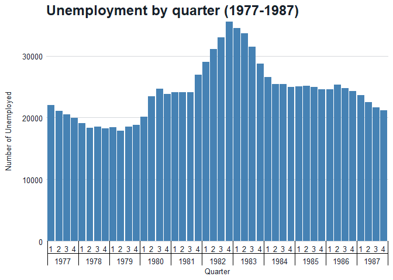
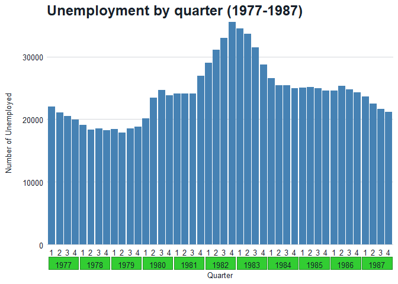

# Multi-row Axis Labels in ggplot
Madelyn Sather
2026-02-19

## Overview

The **legendry** package provides additional guide functionality to the
**ggplot2** ecosystem. More information about the **legendry** package
can be found
[here](https://www.rdocumentation.org/packages/legendry/versions/0.2.1)
and [here](https://teunbrand.github.io/legendry/). In this document, we
will go over how to add multi-row axis labels to your plots using the
**legendry** package. This is especially helpful for date variables.

### Load Libraries

``` r
library(ggplot2)
library(dplyr)
library(lubridate)
library(smcepi)
library(legendry) #devtools::install_github("teunbrand/legendry")
```

### Load Data

``` r
data <- ggplot2::economics
glimpse(data)
```

    Rows: 574
    Columns: 6
    $ date     <date> 1967-07-01, 1967-08-01, 1967-09-01, 1967-10-01, 1967-11-01, …
    $ pce      <dbl> 506.7, 509.8, 515.6, 512.2, 517.4, 525.1, 530.9, 533.6, 544.3…
    $ pop      <dbl> 198712, 198911, 199113, 199311, 199498, 199657, 199808, 19992…
    $ psavert  <dbl> 12.6, 12.6, 11.9, 12.9, 12.8, 11.8, 11.7, 12.3, 11.7, 12.3, 1…
    $ uempmed  <dbl> 4.5, 4.7, 4.6, 4.9, 4.7, 4.8, 5.1, 4.5, 4.1, 4.6, 4.4, 4.4, 4…
    $ unemploy <dbl> 2944, 2945, 2958, 3143, 3066, 3018, 2878, 3001, 2877, 2709, 2…

### Clean Data

Let’s add some date variables that we might want to show on our axis.

``` r
data_clean <- data %>%
  mutate(year = year(date),
         qtr = quarter(date))
```

## Create a Plot with Multi-row Axis Labels

### Interaction Function

To create multi-row axis labels, you’ll need to include `interaction()`
inside of `aes()` for whichever axis you want your multi-row label to be
on. `interaction()` computes a factor which represents the interaction
of the given factors and creates a combined factor for plotting. The
result is always unordered. Include the variables of interest inside
`interaction()`. You will have to put these in the order of which you
would like them to appear on the axis, with the first variable nested
inside of the second variable.

``` r
graph_by_qtr <- data_clean %>%
  filter(year %in% 1977:1987) %>%
  group_by(qtr, year) %>%
  summarize(tot_unemploy = sum(unemploy)) %>%
  ungroup() %>%
  ggplot(aes(x = interaction(qtr, year),
             y = tot_unemploy)) + 
  geom_col(fill = "steelblue") +
  labs(title = "**Unemployment by quarter (1977-1987)**",
       x = "Quarter",
       y = "Number of Unemployed") +
  scale_y_continuous(limits = c(0, NA),
                     expand = c(0, 0)) +
  theme_gg_smc()
```

### Guide Axis Nested Function

Next, you’ll also want to include `guide_axis_nested()` from the
**legendry** package inside of `guides()`. This function is what creates
the multi-level (nested) axis labels. You’ll need to specifiy which axis
you want your nested axis on. More information about
`guide_axis_nested()` can be found
[here](https://www.rdocumentation.org/packages/legendry/versions/0.2.1/topics/guide_axis_nested).

Below is an example graph of the number of unemployed by quarter over a
period of ten years. Here I’ve included `type = "fence"`, which draws
vertical lines between groups, and `rail = "inner"`, which draws a
horizontal line between groups.

``` r
graph_by_qtr + guides(x = guide_axis_nested(type = "fence", 
                                            rail = "inner"))
```



### Theme Guide Function

You can also play around with different themes using `theme_guide()`
from the **legendry** package. `theme_guide()` allows you to customize
the appearance of the axes using theme elements. More information on the
theme_guide() function can be found
[here](https://www.rdocumentation.org/packages/legendry/versions/0.2.1/topics/theme_guide).

Here are some of example graphs of different ways to style the nested
axis using `theme_guide()`.

``` r
graph_by_qtr + guides(x = guide_axis_nested(type = "box")) +
  theme_guide(box = element_rect("limegreen", "forestgreen"))
```



``` r
graph_by_qtr + guides(x = guide_axis_nested(type = "fence", rail = "inner")) +
  theme_guide(
    fence.post = element_line("tomato"),
    fence.rail = element_line("dodgerblue")
  )
```


