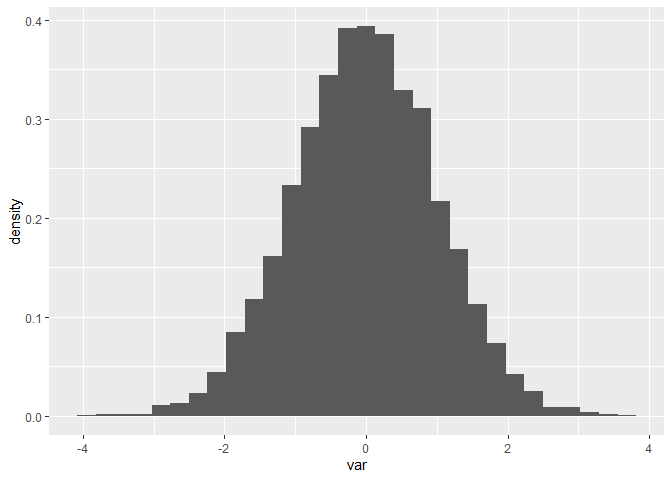
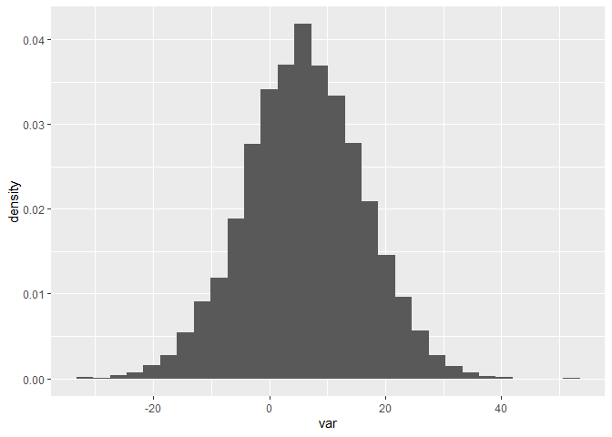
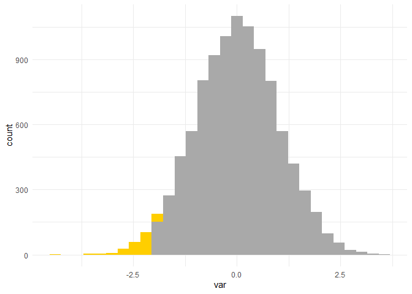
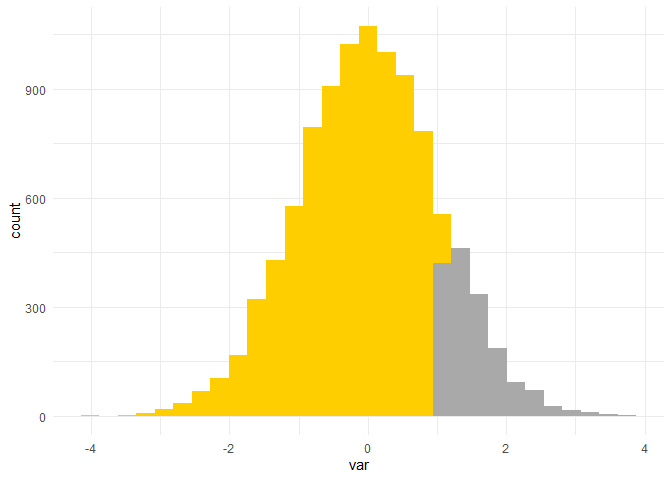
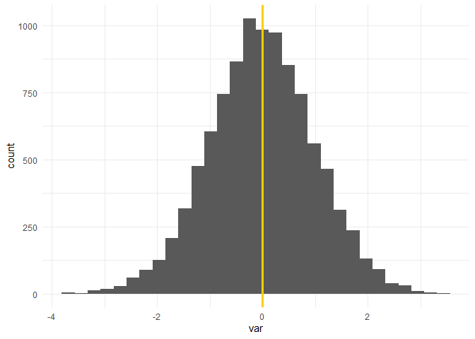
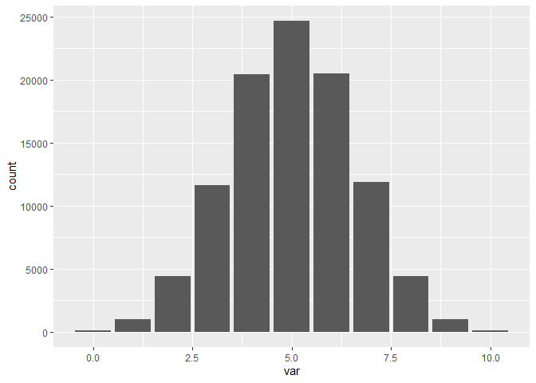
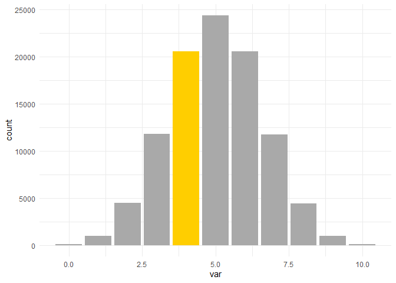

# `stat` distribution functions
Beth Jump
2025-07-24

``` r
library(tidyverse)
```

## Background

R was originally created for statisticians and there are some very handy
functions in the `stats` package which is included with the R
installation.

Here we’ll go through four functions that you can use with normal
distributions. There are corollaries of these functions for other
distributions including: binomial, uniform, exponential, gamma, F,
Cauchy, etc.

A full list of functions is on the [`stats` package
website](https://stat.ethz.ch/R-manual/R-devel/library/stats/html/00Index.html).

## Normal distribution functions

If you want a quick refresher on a normal distribution, you can review
this [wikipedia
page](https://en.wikipedia.org/wiki/Normal_distribution). A couple
important things:

- A normal distribution is a symmetrical distribution centered at 0 with
  a standard deviation of 1.
- ~95% of all observations should be within 2 SDs of the mean (center)
  and ~98% should be within 3 SDs.
- Linear regression, using standard deviations to measure spread and
  other statistical methods all rely on data being approximately normal
- A z-score is the number of standard units from the mean. The
  calculation is simply: `(observed_value-mean)/standard deviation`
- Z-scores are based on and used with the normal distribution.
- p-values are the area of the curve from the Z-score to one or both
  tails and tell you the probability that your observation or a more
  extreme observation exists in a normal distribution with your
  specified mean and standard deviation

### rnorm()

`rnorm()` will generate a vector of numbers that are randomly generated
from a normal distribution. By default it will assume a normal
distribution centered at 0 with a standard deviation of 1.

``` r
rnorm(10000) %>%
  data.frame() %>%
  rename(var = 1) %>%
  ggplot() + 
  geom_histogram(aes(x = var, y = ..density..))
```



You can override the defaults and change the mean and standard deviation
of your normal distribution:

``` r
rnorm(10000, mean = 6, sd = 10) %>%
  data.frame() %>%
  rename(var = 1) %>%
  ggplot() + 
  geom_histogram(aes(x = var, y = ..density..))
```



If your data need to have a certain shape, using `rnorm()` (or one of
the `_norm()` functions) is likely a better option than trying to play
around with the parameters of `sample()`.

### pnorm()

You can use `pnorm()` to get a p-value from a z-score, though you might
need to manipulate the results a bit. `pnorm()` gives you the area from
the left edge of the curve to the inputted z-score.

Here we are calculating the probability of seeing a z-score of -2 or
less than -2 on a normal distribution:

``` r
pnorm(-2)
```

    [1] 0.02275013

This is what that looks like graphically:

``` r
zscore <- -2

rnorm(10000) %>%
  data.frame() %>%
  rename(var = 1) %>%
  mutate(color = case_when(var <= zscore ~ "low",
                           TRUE ~ "regular")) %>%
  ggplot() + 
  geom_histogram(aes(x = var, fill = color, bins = 40)) +
  scale_fill_manual(values = c("low" = "#ffce00",
                                "regular" = "darkgrey")) +
  theme_minimal() + 
  guides(fill="none")
```



Here we are calculating the probability of seeing a z-score of 1 or less
than 1 on a normal distribution:

``` r
pnorm(1)
```

    [1] 0.8413447

This is what that looks like graphically:

``` r
zscore <- 1

rnorm(10000) %>%
  data.frame() %>%
  rename(var = 1) %>%
  mutate(color = case_when(var <= zscore ~ "low",
                           TRUE ~ "regular")) %>%
  ggplot() + 
  geom_histogram(aes(x = var, fill = color, bins = 40)) +
  scale_fill_manual(values = c("low" = "#ffce00",
                                "regular" = "darkgrey")) +
  theme_minimal() + 
  guides(fill="none")
```



If we wanted the probability of seeing a z-score of 1 or greater, we can
calculate it one of two ways:

``` r
1 - pnorm(1)
```

    [1] 0.1586553

``` r
pnorm(-1)
```

    [1] 0.1586553

A p-value is the probability of observing a given z-score or a more
extreme z-score if the observed value is on the normal distribution.

### qnorm()

`qnorm()` is the inverse of `pnorm()` as it will give you the z-score
for a given p-value. Here is the z-score we would need to see to get a
p-value of 0.025:

``` r
qnorm(0.025)
```

    [1] -1.959964

Note that like `pnorm()` this is just the left side. A z-score of -2
means that value is 2 standard units less than the mean and a z-score of
2 means the value is 2 standard units greater than the mean.

### dnorm()

`dnorm()` gives you the probability of observing your z-score exactly.
This isn’t super useful for a normal distribution as we typically don’t
care about the probability of our z-score - we typically just want to
know if our value is part of the observed distribution - but this is
useful in the binomial distribution where we might be interested in the
probability of the exact number of successes.

If we want to know the probability we’ll have a z-score of 0 on a normal
distribution, we can run this to find out the probability is ~40%.

``` r
dnorm(0)
```

    [1] 0.3989423

If you look at this graphically, it’s the probability that your value
falls on this line:

``` r
zscore <- 0

rnorm(10000) %>%
  data.frame() %>%
  rename(var = 1) %>%
  ggplot() + 
  geom_histogram(aes(x = var, bins = 40)) +
  geom_vline(aes(xintercept = zscore), 
             color = "#ffce00",
             size = 1.2) +
  theme_minimal() + 
  guides(fill="none")
```



Just for fun, here’s how this would work on a binomial distribution.
Reminder that a binomial distribution is a distribution generated by two
outcomes. Think of the results of flipping a coin.

Here is a chart of 100,000 trials of the number of heads (or tails) in
10 flips of a coin:

``` r
rbinom(100000, 10, 0.5) %>%
  data.frame() %>%
  rename(var = 1) %>%
  ggplot() +
  geom_bar(aes(x = var))
```



Here we might want to know the probability of getting 4 heads in 10
flips. That probability is calculated with dbinom:

``` r
dbinom(4, 10,  0.5)
```

    [1] 0.2050781

That probability is the height of the highlighted bar:

``` r
rbinom(100000, 10, 0.5) %>%
  data.frame() %>%
  rename(var = 1) %>%
  mutate(color = case_when(var == 4 ~ "highlight",
                           TRUE ~ "none")) %>% 
  ggplot() +
  geom_bar(aes(x = var, fill = color)) + 
  scale_fill_manual(values = c("highlight" = "#ffce00",
                                "none" = "darkgrey")) +
  theme_minimal()  + 
  guides(fill="none")
```


