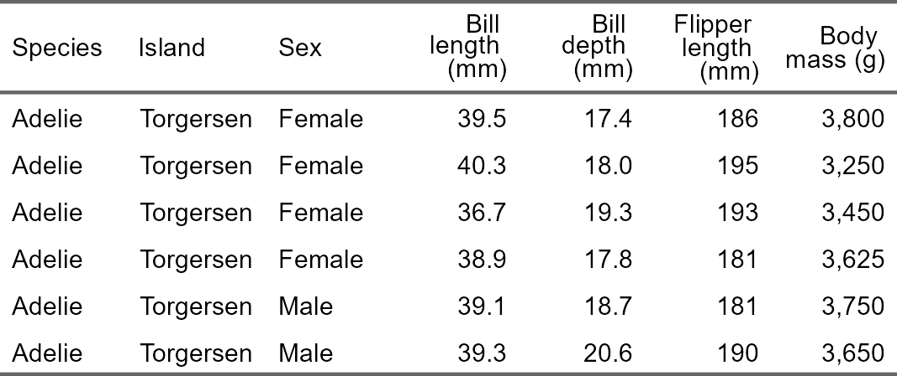

# packages for formatting tables
Eamonn Hartmann, Madelyn Sather, Sayema Badar, Beth Jump
2026-05-14

## Background

There are many packages you can use to format a table in Quarto. This
document goes over 5 of them:

- [flextable](https://ardata-fr.github.io/flextable-book/):
- [gt](https://gt.rstudio.com/)
- `kable` and `kableExtra`
  - [package
    info](https://cran.r-project.org/web/packages/kableExtra/vignettes/awesome_table_in_html.html)  
  - [quarto with
    examples](https://github.com/San-Mateo-County-Health-Epidemiology/R-User-Group/blob/main/quarto-markdowns/table-formatting-kableextra.md)  
- [tinytable](https://vincentarelbundock.github.io/tinytable/)
- `DT`
  - [package info](https://rstudio.github.io/DT/)  
  - [quarto with
    examples](https://github.com/San-Mateo-County-Health-Epidemiology/R-User-Group/blob/main/quarto-markdowns/table-formatting-dt.md)

In each section below, a different package is used to format the
`palmerpenguins::penguins` data set. The code will go over how to:

- change the font type, font size and whether the font is regular,
  **bold** or *italic*
- set column widths and heights
- change the font color and the background of the cell
- change the color and thickness of lines separating cells
- format the header of the table
- align text in a column (text should always be left aligned, numbers
  should always be right aligned)
- merge cells vertically and horizontally.

### Compatible formats

Generally, this is how you should use these packages:

| package      | save as PDF | HTML Quarto | PDF/Typst Quarto | Word Quarto |
|--------------|-------------|-------------|------------------|-------------|
| `flextable`  | x           |             | x                | x           |
| `gt`         |             | x           |                  |             |
| `kableExtra` |             | x           | x                | x           |
| `tinytable`  | x           | x           | x                | x           |
| `DT`         |             | x           |                  |             |

``` r
library(palmerpenguins)
library(tidyverse)

penguins <- palmerpenguins::penguins
```

## `flextable`

``` r
library(flextable)
library(officer)
```

### Clean data and create flextable

``` r
penguins_table <- penguins %>%
  filter(!if_any(everything(), is.na)) %>%
  select(species, island, sex, bill_length_mm, bill_depth_mm, flipper_length_mm, body_mass_g) %>%
  mutate(sex = str_to_title(sex)) %>%
  head() %>%
  arrange(sex) %>%
  flextable()
```

### Change font type, size, bold, italics

For each of the following functions, use `i =` to change the font
parameters of a specific row and use `j =` to change the font parameters
of a specific column.

``` r
penguins_table %>%  
  font(fontname = "Arial", part = "all") %>%
  fontsize(size = 12, part = "body") %>% 
  bold(bold = TRUE, part = "header") %>% 
  italic(italic = TRUE, part = "header") 
```


### Set cell width & height

For `width()`, use `j =` to adjust the width of a specific column. For
`height()`, use `i =` to adjust the height of a specific row.

``` r
penguins_table %>%    
  width(width = 1.2, unit = "in") %>%
  height(height = 0.5, part = "header")
```


### Set font color

The `officer` package is required to change the color of the font and
background of cells and the thickness of the lines separating the cells.

``` r
custom_line <- fp_border(color = "grey", style = "solid", width = 1)

penguins_table %>%  
  color(i = 6, j = 5, color = "red", part = "body") %>% 
  bg(i = 2, j = 4, bg = "yellow", part = "body") %>% 
  border_inner(border = custom_line)
```


### Set header labels

``` r
penguins_table %>%
  set_header_labels(species = "Species", 
    island = "Island", bill_length_mm = "Bill length (mm)",
    bill_depth_mm = "Bill depth (mm)", flipper_length_mm = "Flipper length (mm)",
    body_mass_g = "Body mass (g)", sex = "Sex", year = "Year")
```



### Add row of labels to header

``` r
penguins_table %>%
  add_header_row(values = c("Demographics", "Body measurements"), colwidths = c(3, 4)) %>%
  align(i = 1, part = "header", align = "left")
```


### Align contents within cell

``` r
penguins_table %>%
  align(j = c(1:3), align = "left") %>%
  align(j = c(4:7), align = "right")
```


### Merge cells vertically

``` r
penguins_table %>%
  merge_v(j = ~ species + island)
```


### Merge cells horizontally

The `merge_h()` function merges adjacent cells with duplicate values in
the same row.

``` r
penguins_table %>%
  merge_h()
```


### `autofit()`

The `autofit()` function can be used to adjust the size of cells to fit
the size of the cell’s contents.

``` r
penguins_table %>%
  autofit()
```


## `gt`

The **gt** package is a great package to use for tables when your format
is HTML. It offers a wide variety of styling options and is really great
for when you want to dynamically style the table based on the table
contents. There are many different ways to style tables with the **gt**
package, so please see (https://gt.rstudio.com/) for a reference guide
on different styling options.

``` r
library(gt)
```

### Clean data and create GT table

``` r
penguins_table_gt <- penguins %>%
  filter(!if_any(everything(), is.na)) %>%
  select(species, island, sex, bill_length_mm, bill_depth_mm, flipper_length_mm, body_mass_g) %>%
  mutate(sex = str_to_title(sex)) %>%
  head() %>%
  arrange(sex) %>%
  gt::gt()
```

### Change font type, size, bold, italics

The `opt_table_font()` function can be used to change font type, size,
bold, and italics for the entire table.

``` r
penguins_table_gt %>%
  opt_table_font(font = "Arial",
                 size = "12px",
                 weight = "bold",
                 style = "italic")
```

The `tab_style()` and `locations()` functions can be used to change font
type, size, bold, and italics for specific rows/columns, the table body,
or the table header.

``` r
penguins_table_gt %>%
  
  # table headers
  tab_style(style = cell_text(size = "16px", 
                              weight = "bold"),
            locations = cells_column_labels(columns = everything())) %>%
  
  # table body
  tab_style(style = cell_text(size = "9px"),
            locations = cells_body()) %>%
  
  # specific row
  tab_style(style = cell_text(style = "italic"),
            locations = cells_body(rows = 1)) %>%
  
  # specific column
  tab_style(style = cell_text(weight = "bold"),
            locations = cells_body(columns = bill_length_mm))
```

### Set cell width & height

To set widths and heights for the entire table, use `tab_options()`
function. To set widths for specific columns, use the `cols_width()`
function.

``` r
penguins_table_gt %>%
  
  # Set specific column widths
  cols_width(bill_length_mm ~ px(125)) %>%
  
  # Set row height (affects all rows)
  tab_options(data_row.padding = px(0),
              table.width = px(1000))
```

### Set font color

The `tab_style()` and `locations()` functions can be used to change font
or background color for specific rows/columns and cells.

``` r
penguins_table_gt %>%
    tab_style(style = cell_fill(color = "orange"),
              locations = cells_body(rows = bill_length_mm > 40)) %>%
    
  tab_style(style = cell_text(color = "red"),
            locations = cells_body(columns = bill_length_mm)) %>%
  
  tab_style(style = cell_fill(color = "yellow"),
            locations = cells_body(columns = bill_depth_mm,
                                  rows = bill_depth_mm > 20))
```

### Set header labels

Use the `cols_label` to change the column names.

``` r
penguins_table_gt %>%
  cols_label(species = "Species", 
             island = "Island", 
             bill_length_mm = "Bill length (mm)",
             bill_depth_mm = "Bill depth (mm)", 
             flipper_length_mm = "Flipper length (mm)",
             body_mass_g = "Body mass (g)", 
             sex = "Sex")
```

### Add row of labels to header and titles

Use the `tab_header()` function to add table titles. Use the
`tab_spanner()` function to create grouped column headers (spanners).

``` r
penguins_table_gt %>%
  tab_header(title = md("**Penguins Table**"),
             subtitle = "GT Table") %>%
  tab_spanner(label = "Demographics",
              columns = c("species", "island", "sex")) %>%
  tab_spanner(label = "Body Measurements",
              columns = c("bill_length_mm", "bill_depth_mm", "flipper_length_mm", "body_mass_g"))
```

### Align contents within cell

Use the `cols_align()` function to align the contents within a cell.

``` r
penguins_table_gt %>%
  cols_align(align = "center",
             columns = everything()) %>%
  cols_align(align = "left",
             columns = c("bill_length_mm", "bill_depth_mm", "flipper_length_mm", "body_mass_g"))
```

## `tinytable`

`tinytable` can be considered a lightweight, highly customizable and
rather minimalist package. It involves a quick installation as it does
not require any dependencies (i.e. does not depend on, and therefore
does not load, other packages for its functionality). It is compatible
with HTML, LaTeX, Typst, PDF, and Word. Lastly, it just requires a
handful of functions for its capabilities.

### Clean data and create table with `tinytable`

``` r
library(tinytable)

penguins_tinytable <- penguins %>%
  filter(!if_any(everything(), is.na)) %>%
  select(island, species, sex, bill_length_mm, bill_depth_mm, flipper_length_mm, body_mass_g) %>%
  mutate(sex = str_to_title(sex)) %>%
  head() %>%
  arrange(sex) %>% 
  tt()
```

### Change font type, size, bold, italics

Several formatting options can be done with the `style_tt()` function.
Similar to other table packages, use `i =` when referring to rows and
`j =` when referring to columns.

``` r
penguins_tinytable %>%
  style_tt(fontname = "Calibri", fontsize = 11) %>% 
  style_tt(i = 0, bold = TRUE, italic = TRUE)  # affects only header
```

### Set column widths & heights

`tinytable` handles widths and heights by default. However, if you want
to set these parameters, you can use `tt()`. For width, the parameter
should be expressed as a value between 0 and 1 (i.e. proportion of the
table width). For height, the measurement is in em units. To render in
HTML (e.g. as a Quarto document), you can use `style_tt()` within the
Bootstrap framework. More details in this
[guide](https://vincentarelbundock.github.io/tinytable/vignettes/tinytable_tutorial.pdf).

``` r
penguins_tinytable <- penguins %>%
  filter(!if_any(everything(), is.na)) %>%
  select(island, species, sex, bill_length_mm, bill_depth_mm, flipper_length_mm, body_mass_g) %>%
  mutate(sex = str_to_title(sex)) %>%
  head() %>%
  arrange(sex) %>% 
  tt(width = c(0.1, 0.1, 0.1, 0.15, 0.15, 0.15, 0.15), # either vector length of 1 or x (# number of columns)
     height = 2)
```

### Change font color and background of a cell

color and background arguments within the `style_tt()` function can be
used to set the font color and background color for cells.

``` r
penguins_tinytable %>%
  style_tt(i = 0, j = 1:7, color = "#000080") %>% 
  style_tt(i = 0, j = 1:7, background = "lightgray") %>% 
  style_tt(i = 4, j = 5, background = "magenta") 
```

### Change color and thickness of lines separating cells

line, line_color, and line_width arguments within the `style_tt()`
function can be used to set the color and thickness of the cell borders.
For syntax: “t” = top, “b” = bottom, “l” = left, and “r” = right.

``` r
penguins_tinytable %>% 
  style_tt(i = 0, line = "tblr", line_color = "midnightblue", line_width = 0.3) %>% 
  style_tt(i = 1:6, line = "blr", line_color = "midnightblue", line_width = 0.1)
```

### Format the header of the table

Formatting the header can be done with the `style_tt()` function, using
`i = 0` argument.

``` r
penguins_tinytable %>% 
  style_tt(i = 0, color = "white", background = "black")
```

To group header labels under an additional header, use the `group_tt()`
function

``` r
penguins_tinytable %>% 
  style_tt(j = 1:3, align = "l") %>%  
  style_tt(j = 4:7, align = "r") %>%
  group_tt(j = list("Species & Sex" = 2:3, "Measurements" = 4:7))
```

|  | Species & Sex |  | Measurements |  |  |  |
|----|----|----|----|----|----|----|
| island | species | sex | bill_length_mm | bill_depth_mm | flipper_length_mm | body_mass_g |
| Torgersen | Adelie | Female | 39.5 | 17.4 | 186 | 3800 |
| Torgersen | Adelie | Female | 40.3 | 18.0 | 195 | 3250 |
| Torgersen | Adelie | Female | 36.7 | 19.3 | 193 | 3450 |
| Torgersen | Adelie | Female | 38.9 | 17.8 | 181 | 3625 |
| Torgersen | Adelie | Male | 39.1 | 18.7 | 181 | 3750 |
| Torgersen | Adelie | Male | 39.3 | 20.6 | 190 | 3650 |

### Align contents within cell

For syntax: “l” = left, “r” = right, and “c” = center to align text
using the `style_tt()` function.

``` r
penguins_tinytable %>% 
  style_tt(j = 1:3, align = "l") %>%  
  style_tt(j = 4:7, align = "r")
```

### Merge cells vertically

To merge cells vertically, use the rowspan argument within the
`style_tt()` function. For vertical alignment syntax: “t” = top, “m” =
middle, and “b” = bottom.

``` r
penguins_tinytable %>% 
  style_tt(i = 1, j = 1,
           rowspan = 6,
           alignv = "t") %>% #alignv controls vertical alignment
  style_tt(i = 1, j = 2,
           rowspan = 6,
           alignv = "t")
```

### Merge cells horizontally

To merge cells horizontally, use the colspan argument within the
`style_tt()` function.

``` r
penguins_tinytable %>% 
  style_tt(i = 3, j = 4,
           colspan = 3,
           align = "c") #align controls horizontal alignment
```
