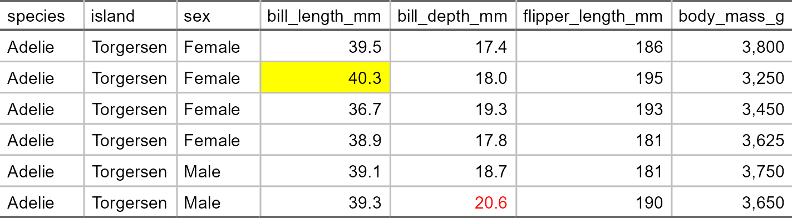

# table-formatting-flextable


## `flextable`

``` r
library(palmerpenguins)
```

    Warning: package 'palmerpenguins' was built under R version 4.5.2


    Attaching package: 'palmerpenguins'

    The following objects are masked from 'package:datasets':

        penguins, penguins_raw

``` r
library(tidyverse)
```

    Warning: package 'ggplot2' was built under R version 4.5.3

    ── Attaching core tidyverse packages ──────────────────────── tidyverse 2.0.0 ──
    ✔ dplyr     1.1.4     ✔ readr     2.1.5
    ✔ forcats   1.0.1     ✔ stringr   1.5.2
    ✔ ggplot2   4.0.3     ✔ tibble    3.3.0
    ✔ lubridate 1.9.4     ✔ tidyr     1.3.1
    ✔ purrr     1.1.0     

    ── Conflicts ────────────────────────────────────────── tidyverse_conflicts() ──
    ✖ dplyr::filter() masks stats::filter()
    ✖ dplyr::lag()    masks stats::lag()
    ℹ Use the conflicted package (<http://conflicted.r-lib.org/>) to force all conflicts to become errors

``` r
library(flextable)
```

    Warning: package 'flextable' was built under R version 4.5.3


    Attaching package: 'flextable'

    The following object is masked from 'package:purrr':

        compose

``` r
library(officer)
```

    Warning: package 'officer' was built under R version 4.5.3

``` r
penguins <- palmerpenguins::penguins
```

### Clean data and create flextable

``` r
penguins_table <- penguins %>%
  filter(!if_any(everything(), is.na)) %>%
  select(species, island, sex, bill_length_mm, bill_depth_mm, flipper_length_mm, body_mass_g) %>%
  mutate(sex = str_to_title(sex)) %>%
  head() %>%
  arrange(sex) %>%
  flextable()
```

### Change font type, size, bold, italics

For each of the following functions, use `i =` to change the font
parameters of a specific row and use `j =` to change the font parameters
of a specific column.

``` r
penguins_table %>%  
  font(fontname = "Arial", part = "all") %>%
  fontsize(size = 12, part = "body") %>% 
  bold(bold = TRUE, part = "header") %>% 
  italic(italic = TRUE, part = "header") 
```


### Set cell width & height

For `width()`, use `j =` to adjust the width of a specific column. For
`height()`, use `i =` to adjust the height of a specific row.

``` r
penguins_table %>%    
  width(width = 1.2, unit = "in") %>%
  height(height = 0.5, part = "header")
```


### Set font color

The `officer` package is required to change the color of the font and
background of cells and the thickness of the lines separating the cells.

``` r
custom_line <- fp_border(color = "grey", style = "solid", width = 1)

penguins_table %>%  
  color(i = 6, j = 5, color = "red", part = "body") %>% 
  bg(i = 2, j = 4, bg = "yellow", part = "body") %>% 
  border_inner(border = custom_line)
```



### Set header labels

``` r
penguins_table %>%
  set_header_labels(species = "Species", 
    island = "Island", bill_length_mm = "Bill length (mm)",
    bill_depth_mm = "Bill depth (mm)", flipper_length_mm = "Flipper length (mm)",
    body_mass_g = "Body mass (g)", sex = "Sex", year = "Year")
```


### Add row of labels to header

``` r
penguins_table %>%
  add_header_row(values = c("Demographics", "Body measurements"), colwidths = c(3, 4)) %>%
  align(i = 1, part = "header", align = "left")
```


### Align contents within cell

``` r
penguins_table %>%
  align(j = c(1:3), align = "left") %>%
  align(j = c(4:7), align = "right")
```


### Merge cells vertically

``` r
penguins_table %>%
  merge_v(j = ~ species + island)
```


### Merge cells horizontally

The `merge_h()` function merges adjacent cells with duplicate values in
the same row.

``` r
penguins_table %>%
  merge_h()
```


### `autofit()`

The `autofit()` function can be used to adjust the size of cells to fit
the size of the cell’s contents.

``` r
penguins_table %>%
  autofit()
```


