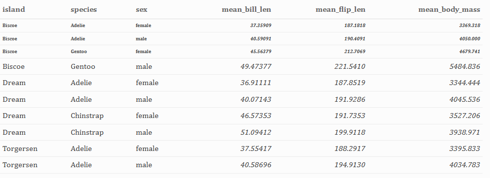
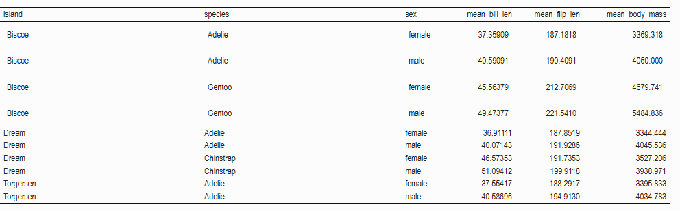
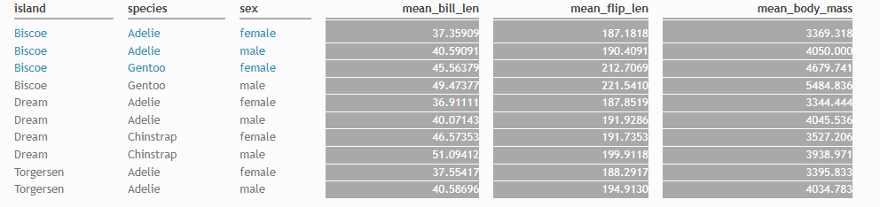
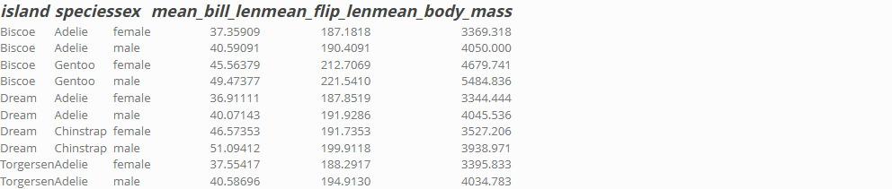
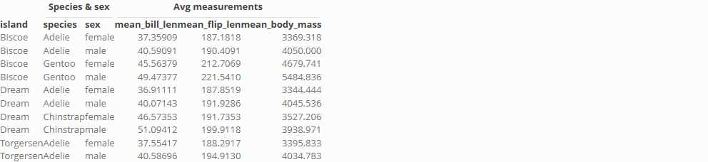
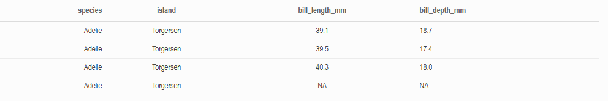
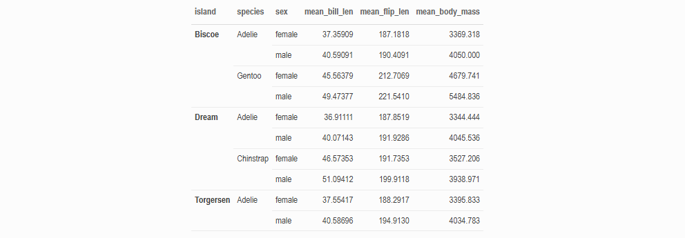
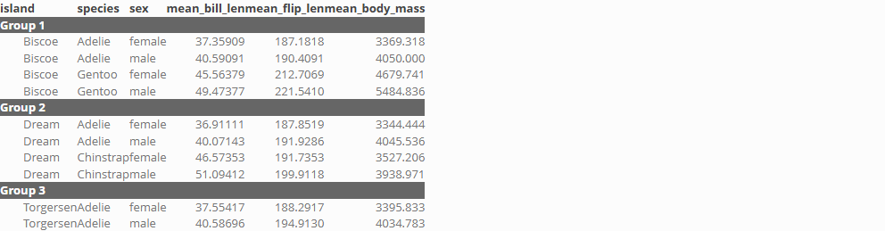

See [here](https://github.com/San-Mateo-County-Health-Epidemiology/R-User-Group/blob/main/quarto-markdowns/table-formatting-comparison.md) for information about other packages for formatting tables. 

```{r}
library(palmerpenguins)
library(tidyverse)
library(kableExtra)
library(here)

penguins <- palmerpenguins::penguins
```

## `kable and kableExtra`

`kable` and `kableExtra` are a great option for making HTML tables. This [guide](https://cran.r-project.org/web/packages/kableExtra/vignettes/awesome_table_in_html.html) includes tons of examples of customization for `kableExtra` tables!

### Clean data and create kable table

```{r}
penguins_kable <- penguins %>%
  filter(!if_any(everything(), is.na)) %>%
  group_by(island, species, sex) %>%
  summarize(mean_bill_len = mean(bill_length_mm, na.rm = T),
            mean_flip_len = mean(flipper_length_mm, na.rm = T),
            mean_body_mass = mean(body_mass_g, na.rm = T),
            .groups = "keep") %>%
  ungroup() %>%
  kable()
```

### Change font type, size, bold, italics

You can set the `font_size` in the kable theme or in `row_spec()` but it doesn't work if you set it in `column_spec()`

```{r}
k1 <- penguins_kable %>%
  kable_paper(html_font = "Cambria", font_size = 16) %>%
  row_spec(1:3, bold = TRUE, font_size = 10) %>%
  column_spec(4:6, italic = TRUE)
```


```{r}
#| echo: false
save_kable(k1,
           here("quarto-markdowns/table-formatting-images/kableextra1.png"))
```



### Set column widths & heights

You can easily set column widths with the `width` argument. Making the columns taller is a bit less straightforward but using the `extra_css = "padding: 10px"` works. You can change the "10px" to however many pixels or inches you want.

```{r}
k2 <- penguins_kable %>%
  kable_classic() %>%
  column_spec(1:2, width = c('30%', '30%')) %>%
  row_spec(1:4,
           extra_css = "padding: 10px")
```


```{r}
#| echo: false
save_kable(k2,
           here("quarto-markdowns/table-formatting-images/kableextra2.png"),
           density = 500)
```



### Change font color and background of a cell

`row_spec()` and `column_spec()` allow you to color specific rows and columns by position.

```{r}
k3 <- penguins_kable %>%
  kable_minimal() %>%
  row_spec(1:3, color = "#2C92B8") %>%
  column_spec(4:6, background = "darkgrey", color = "white")
```


```{r}
#| echo: false
save_kable(k3,
           here("quarto-markdowns/table-formatting-images/kableextra3.png"),
           density = 500)
```



### Change color and thickness of lines separating cells

The easiest way to do this is by using the different themes (`kable_minimal`, `kable_paper`, etc) that are built into the `kableExtra` package. If you want to change the lines on a specific cell, you can try playing around with LaTeX as proposed [here](https://stackoverflow.com/questions/77647118/how-to-add-horizontal-lines-in-kable-and-the-bottom-line-being-thicker-and-orang).

### Format the header of a the table

In `kableExtra` you can format the header with the `row_spec()` function by referring to the top row as 0.

```{r}
k4 <- penguins_kable %>%
  row_spec(0, font_size = 18, bold = T, italic = T)
```


```{r}
#| echo: false
save_kable(k4,
           here("quarto-markdowns/table-formatting-images/kableextra4.png"),
           density = 500)
```



Here's how to add an additional header above the table.

```{r}
k5 <- penguins_kable %>%
  add_header_above(c("", "Species & sex" = 2, "Avg measurements" = 3), bold = TRUE)
```


```{r}
#| echo: false
save_kable(k5,
           here("quarto-markdowns/table-formatting-images/kableextra5.png"),
           density = 500)
```



### Align contents within cell

By default, `kableExtra` aligns text to the left and numbers to the right, which is excellent!! If you want to align all of the cells in the table, you can use `align = "c"` (or `"l"` or `"r"`) in the `kbl()` function.

```{r}
k6 <- penguins[1:4, 1:4] %>%
  kable(align = 'rccl') %>%
  kable_paper()
```


```{r}
#| echo: false
save_kable(k6,
           here("quarto-markdowns/table-formatting-images/kableextra6.png"),
           density = 500)
```



### Merge cells vertically

The `collapse_rows()` function makes this super easy!

```{r}
k7 <- penguins_kable %>%
  kable_paper(full_width = F) %>%
  column_spec(1, bold = T) %>%
  collapse_rows(columns = 1:2, valign = "top")
```


```{r}
#| echo: false
save_kable(k7,
           here("quarto-markdowns/table-formatting-images/kableextra7.png"),
           density = 500)
```



### Merge cells horizontally

It doesn't seem like you can merge columns in `kableExtra` but you can group sets of rows with `pack_rows()` which might come in handy.

```{r}
k8 <- penguins_kable %>%
  pack_rows(index = c("Group 1" = 4,
                      "Group 2" = 4, 
                      "Group 3" = 2),
            label_row_css = "background-color: #666; color: #fff;")
```


```{r}
#| echo: false
save_kable(k8,
           here("quarto-markdowns/table-formatting-images/kableextra8.png"),
           density = 500)
```



### Bonus: adding plots into the table

`kableExtra` makes it pretty easy to add tiny plots to your table! See [here](https://cran.r-project.org/web/packages/kableExtra/vignettes/awesome_table_in_html.html#Insert_Images_into_Columns) (you need to scroll down a bit to the section just before `Row Spec`) for an example!