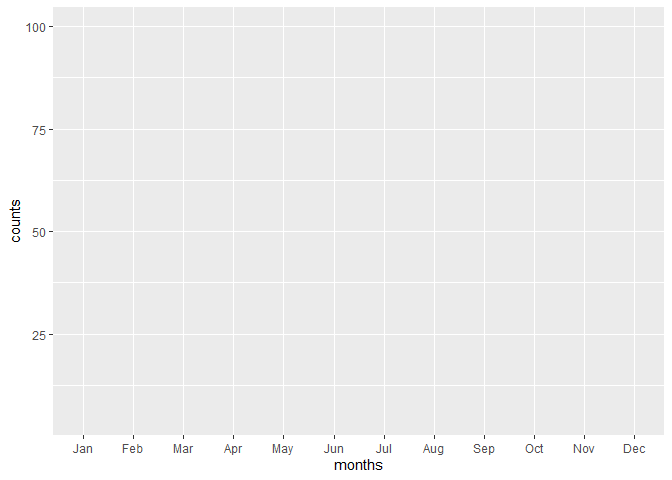
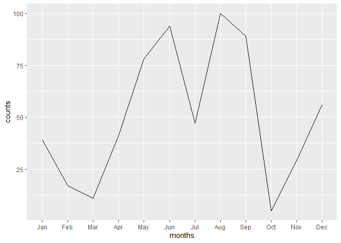

# when and how to use factors
Beth Jump
2026-04-16

## Background

Factors are a way to store your string/character data as ordered values.
An interesting (and brief) history of factors in R is
[here](https://simplystats.github.io/2015/07/24/stringsasfactors-an-unauthorized-biography/).
The [`forcats`](https://forcats.tidyverse.org/) package is a tidyverse
package for dealing with factors.

When would you want to store your data in factors?

- If you need to sort by a categorical value in a way that is not
  alphabetical (ex: by month, county region, race/ethnicity, etc. )
- If you’re using a string variable in a mathematical model
- ??

When would it be better to store your character data as a string?

- If you need to manipulate the contents of the string
- If your character variable isn’t easily grouped (ex: a notes field, a
  list of first names, etc.)
- If you’re assigning factors based on other variables in an automated
  or semi-automated script where data might change. You can still use a
  factor, but you should assign the values explicitly.
- ??

## Motivating example

Let’s say we have a list of months. We want to sort these
chronologically. If we sort the character variable, we end up with an
*alphabetical* list:

``` r
month_list <- c("March", "July", "April", "August")
sort(month_list)
```

    [1] "April"  "August" "July"   "March" 

Instead, we can make this into a factor and assign the levels according
to the chronological order of months. Then our data will sort correctly!

``` r
levels <- as.character(month(1:12, abbr = F, label = T))

month_list_factor <- factor(x = month_list,
                            levels = levels)

sort(month_list_factor)
```

    [1] March  April  July   August
    12 Levels: January February March April May June July August ... December

## Useful functions

### making a factor

Using the `base::factor()` function is the most straightforward way to
make a factor but it can be a pain to list out every value if your
factor has many levels. Luckily, the `forcats` package has some
functions that can make creating factors quicker and more dynamic!

#### by a different variable

If you want one variable to be ordered by a different variable, you can
use `fct_reorder()`.

Here we are sorting colors by the length of each color (ex: blue = 4,
yellow = 6)

``` r
data.frame(
  colors = c("blue", "orange", "yellow", "green", "red")
) %>%
  mutate(letter_count = nchar(colors),
         color_fct = fct_reorder(colors, letter_count)) %>%
  arrange(color_fct)
```

      colors letter_count color_fct
    1    red            3       red
    2   blue            4      blue
    3  green            5     green
    4 orange            6    orange
    5 yellow            6    yellow

Note that “yellow” and “orange” have the same number of letters so they
are ordered somewhat arbitrarily. You could override this by assigning
levels manually.

More examples are
[here](https://forcats.tidyverse.org/reference/fct_reorder.html).

#### by a frequency

`forcats` has a very handy function called `fct_infreq()` that will
order your data from most to least frequent.

``` r
data <- data.frame(
  colors = sample(c("blue", "orange", "yellow", "green", "red"), 1000, replace = T, prob = (5:1))
) %>%
  group_by(colors) %>%
  mutate(count = n()) %>%
  ungroup()

data %>%
  mutate(colors = fct_infreq(colors)) %>%
  arrange(colors) %>%
  distinct(colors, count)
```

    # A tibble: 5 × 2
      colors count
      <fct>  <int>
    1 blue     335
    2 orange   288
    3 yellow   193
    4 green    120
    5 red       64

As far as I can tell there is no `fct_freq()` (to order things from
small to large), but the internet suggests wrapping `fct_infreq()` in
`fct_rev()` to reverse the order of the factors:

``` r
data %>%
  mutate(colors_fct = fct_rev(fct_infreq(colors))) %>%
  arrange(colors_fct) %>%
  distinct(colors, colors_fct, count)
```

    # A tibble: 5 × 3
      colors colors_fct count
      <chr>  <fct>      <int>
    1 red    red           64
    2 green  green        120
    3 yellow yellow       193
    4 orange orange       288
    5 blue   blue         335

#### by a frequency for a chart

In data visualizations, sometimes we can’t show all categories. There is
a fun function called `fct_lump` that will lump smaller groups together:

``` r
data1 <- data %>%
  mutate(colors_fct = fct_lump(colors, n = 2))
   
levels(data1$colors_fct)
```

    [1] "blue"   "orange" "Other" 

For more info and functions, check out the [cheat
sheet](https://rstudio.github.io/cheatsheets/html/factors.html).

## A note about factors in `ggplot2`

If you want to use a factor on either axis of the plot, you might get an
empty plot and an error saying, “each group consists of only one
observation. Do you need to adjust the group aesthetic?”

``` r
library(ggplot2) 

data <- data.frame(
  months = month(1:12, label = T),
  counts = sample(1:100, 12)) 

data %>%
  ggplot() + 
  geom_line(aes(x = months, 
                y = counts))
```



You can fix this by adding `group = 1` to the `aes()` mapping:

``` r
data %>%
  ggplot() + 
  geom_line(aes(x = months, 
                y = counts,
                group = 1))
```


